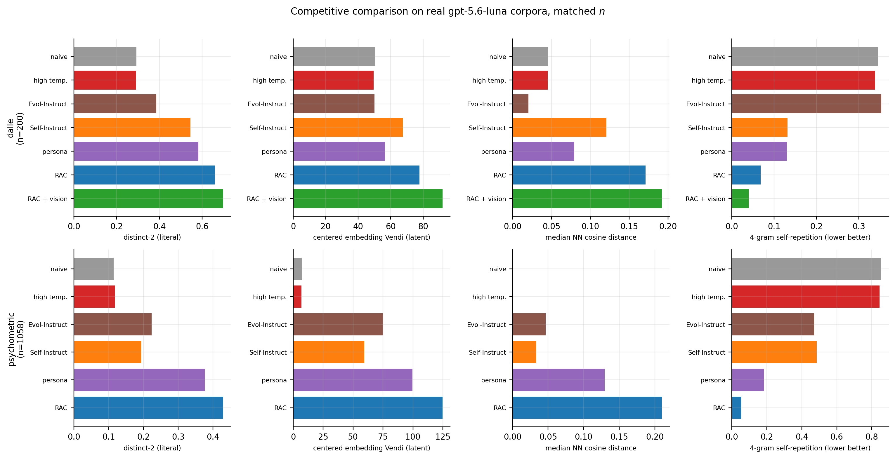

## Abstract

A synthetic corpus is judged by a measure, and the measure is chosen before the
corpus is. **Recursive Axis Conditioning** (RAC) is a generation loop that
improves a *chosen* measure: it asks the generator to name the language-valued
axes along which its own outputs can differ, ranks them, takes their
most-different levels, and splits an exhausted axis into finer sub-axes. The
measure enters at exactly two points — how an axis is scored and how one of *K*
candidates is selected — and everything else is shared.

It wins where it is pointed. On coverage of a held-out human-written reference
that no corpus was aimed at, RAC places **first of twelve corpora, 0.4441 against
Alpaca's 0.3722** at matched evaluated *n*, from 2,400 generator calls against
Alpaca's 52,000, with the highest precision in the field (0.973); PersonaHub
(50k) and WizardLM Evol-Instruct (143k) finish below RAC's 304-item selective
arm. On automatic item generation, a naively prompted bank of 2,500 items yields
**382 that can legally coexist on one exam form — 15.3% of nominal capacity**,
against 94.9% for human-written MMLU, while RAC's 1,999-item bank contains **no
enemy pair at all** at a blind-adjudicated radius.

The evidence we trust most is measured in channels the loop never optimizes, so
it cannot be a restatement of the selection rule. At matched generator budget,
RAC separates from the strongest available comparison in all three artifact
domains: **2.25× the prosodic spread** of naive prompting on 200 of 200 random
draws (2.02× with every length feature removed); **97.6% distinct item
architectures against 43.9%** after deleting every exact duplicate from both
banks; and **1.53× the optical spread** on pixel statistics, [1.38, 1.68], with
every one of eleven RAC image corpora above every one of five published
baselines (*U* = 55 of 55, *p* = 0.0002).

Two results generalize past the method. First, **corpus objectives divide into
two classes and the machinery load-bearing for one is harmful to the other**.
Greedy *k*-center, the classical packing algorithm, wins min-gap in both of our
domains and finishes last on coverage, at a sixth of random selection;
orthogonalized conditioning, which is what makes RAC work under max-min, finishes
last of the nine seeded arms on coverage and below plain conditioning at both
matched *n* and matched budget; the two highest-Vendi selectors are the two worst
covering ones. A diversity number carries no
information until its objective is named.

Second, a **completeness rule** for conditioning, established over seven
controlled comparisons with blind judges. An axis that enumerates a proper subset
of the space a measure is defined over displaces concentration into the
complement rather than removing it; only enumerating the whole space reduces it.
Naming five of ten task categories drove the unnamed five from 86% of a corpus to
19% and changed total spread not at all (−0.014, 95% CI [−0.080, +0.058]); naming
all ten raised spread in a lumpy corpus (+0.219, [+0.138, +0.297]) and in an
already-flat one (+0.146, [+0.069, +0.225]). Inside a single level the same rule
holds: an axis enumerating every form a red herring can take moved an item bank's
dominant device from 76% of items to 24% (−0.507, [−0.622, −0.389]) while both
arms kept the contract at 100%, where axes naming only part of the realization
space moved poems by 0.04 or made them worse.

Underneath all of it is one limit. We assume an embedding oracle and no inverse —
we can compute where the next item ought to land and cannot decode that point
into text — so steering is language-valued, and no selection rule can exceed what
the conditional support offers. Fifteen numerical checks confirm that novelty at
a fixed prompt decays as $n^{-1/m}$ in the conditional dimension rather than
$n^{-1/d}$ in the ambient one, that a single prompt ε-covers a vanishing
$ε^{d-m}$ fraction, and that only prompt motion transverse to the occupied span
raises the ceiling. Evidence: over 46,000 real generations, ~1,800 rendered
images and ~200 rendered instrumentals, for roughly $40 of API spend.

---

## 1. Introduction

Ask a language model for a poem ten times and you get ten poems. Ask it ten
thousand times and you get a few hundred poems and a great deal of paraphrase.
Any fixed conditional distribution behaves this way under repeated sampling,
whatever model supplies it: the distribution has a shape, and sampling traces
that shape ever more densely rather than expanding it.

The practical version is now everywhere. Synthetic training data is worth what it
adds to the training set; an evaluation suite that clusters in a few families
gives false assurance; test-item banks, red-team prompt sets, persona corpora and
augmentation pipelines all consume generated text in bulk. All of them degrade in
a way that per-item quality checks do not detect — every item is fine, and the
collection is redundant — and the corpora shipped today have it badly. Asked a
reasonable psychometric question ten thousand times, a strong model returns a
bank that is **73.6% byte-identical duplicates**, with one question repeated
2,726 times; of a 2,500-item sample only 382 items can legally coexist on one
exam form.

This paper presents **Recursive Axis Conditioning** (RAC), a generation loop that
fixes this well enough to beat the released state of the art on a twentieth of
its budget, and three results that came out of building it.

**The loop works, and the margin does not come from scale.** Against Alpaca,
PersonaHub and WizardLM Evol-Instruct on coverage of a held-out human reference,
RAC places first of twelve corpora from 2,400 generator calls against Alpaca's
52,000 (§7.3). On psychometric item generation it produces a bank with no enemy
pair at all under a blind-adjudicated radius, where the naive bank yields 15.3%
of its nominal capacity and human-written MMLU yields 94.9% (§7.4). And the
separation survives being measured where the method cannot be gaming it: in each
of the three artifact domains there is a channel nothing in the loop optimizes —
prosody for poems, item architecture for exam banks, pixel statistics for
renders — and RAC separates from the baselines on all three at matched generator
budget (Figure 1, §7.5).

![{{FIG:fig22_out_of_objective.png}}. Separation measured outside the objective. Left: every image corpus at matched *n* = 60 on nine pixel statistics — a channel with no connection to the CLIP or text embeddings the loop selects on. Every one of our eleven corpora exceeds every one of the five published baselines. Right: the same comparison in all three artifact domains, on the channel each domain's objective cannot see, at matched generator budget; intervals are bootstrap 95% CIs on the ratio of group means where the group sizes support them, and the annotation gives the number of resamples favouring RAC.](figures/fig22_out_of_objective.png)

*{{FIG:fig22_out_of_objective.png}}. Separation measured outside the objective. Left: every image corpus at matched n = 60 on nine pixel statistics — a channel with no connection to the CLIP or text embeddings the loop selects on. Every one of our eleven corpora exceeds every one of the five published baselines. Right: the same comparison in all three artifact domains, on the channel each domain's objective cannot see, at matched generator budget; intervals are bootstrap 95% CIs on the ratio of group means where the group sizes support them, and the annotation gives the number of resamples favouring RAC.*

**The objective has to be named before the number means anything.** Corpus
objectives fall into two classes — *covering* the reachable space, and *packing*
it so no two items collide — usually spoken of interchangeably. They are not
interchangeable, and each class's characteristic tool damages the other's score.
Greedy *k*-center, the classical packing algorithm, wins min-gap in both of our
domains and finishes last on coverage, at a sixth of random selection.
Orthogonalized conditioning, the component that makes RAC work under packing,
*reduces* coverage below plain conditioning when carried across, and finishes last
of the nine seeded arms. The two
highest-Vendi selectors we measure are the two worst covering ones (§3).

**Conditioning relocates a corpus's repetition unless it names the whole space
the measure is defined over.** This is the prescription we would keep if we could
keep one. An axis enumerating five of ten task categories moves an enormous
amount of probability mass onto those five and leaves total spread unchanged,
because the five it does not name are driven out; an axis enumerating all ten
raises spread in both a lumpy corpus and an already-flat one. The same rule holds
one level down, inside a single axis level, where a construct realized through
one lexical device is invisible to every realization audit in the literature and
to every diversity measure in this paper (§8.3).

Underneath all three is a single limit, made precise in §4: no selection rule can
outrun the conditional support of the generator it draws from, so the only move
that changes the asymptote is one that widens that support.

### 1.1 The oracle asymmetry

We assume throughout:

> **Assumption (embedding oracle, no inverse).** We have access to *E*: Text → ℝ*D*, computable on demand. We have **no** *E*−1: ℝ*D* → Text.

This is the structural fact that shapes the entire design. Given a corpus
*Xn* we can compute, exactly and cheaply, the point in
ℝ*D* that would most improve any of our diversity measures — the
direction of least occupied spectral energy, the centre of the largest empty
ball, the point maximizing marginal coverage. Knowing that point is worth nothing
on its own, because no procedure turns a target embedding back into a poem.

Consequently the system cannot *solve* for its next item. It can only **propose**
(sample from *p*(· | *x*) for some prompt *x* we can write), **measure** (embed
the proposals and score them), and **select** (keep one). All of the control is
in the choice of *x*, and that choice is expressible only in language. This is
why the latent variables here are language-valued — named axes with named levels
— rather than continuous codes: they are the only handles that reach the
generator. It is also why the axis scoring of §5 exists. **The axis scoring is a
surrogate for the missing inverse**: unable to decode the direction we want to
travel, we score the language-valued conditions we *can* write by how nearly
their induced output distributions point that way.
### 1.2 Contributions

- **A generator loop that improves a chosen measure** (§5). Language-valued axes
  elicited from the generator, ranked by a scoring rule, with exhausted ones split
  recursively into conditional sub-axes. The measure enters at two points only, so
  pointing the loop at a different measure means changing those two and nothing
  else.
- **A competitive result across five domains** (§7). Against five published
  methods at matched *n*, RAC wins every metric in both text domains, beating the
  strongest baseline by 36% in mean-centered Vendi at matched *n* = 1,000; its exam bank contains no
  enemy pair at the judged radius, against 94.9% usable for human-written MMLU
  and 15.3% for naive prompting; and against released instruction corpora it
  places first of twelve at 0.4441 against Alpaca's 0.3722.
- **Separation on channels the method never optimizes** (§7.5), in all three
  artifact domains, at matched generator budget, with the most obvious confound
  removed in each case. These are the comparisons that cannot be a restatement of
  the selection rule, and they are the ones we would defend first.
- **Evidence that the measure has to be named** (§3). Greedy *k*-center wins
  min-gap in both domains and finishes last on coverage, and each measure's
  characteristic tool damages the other's score.
- **A manipulation-based scoring rule for conditioning variables** (§5.3). The
  obvious observational estimator is not merely noisy but *inverted*: it penalizes
  an axis in proportion to how well the axis works. On data where the answer is
  fixed by construction, the observational form ranks the inert axis first in 17
  of 24 runs; the repair recovers the true order in 24 of 24.
- **The completeness rule for conditioning** (§8.3), with the two audits that
  make it visible: realization has to be checked between levels *and* within one,
  and an axis can be present, obeyed, and still realized the same way every time.
- **A theory of what limits both objectives** (§4), with fifteen numerical checks.

**What is deferred to a companion paper.** Every measure here is computed in an
embedding, and in two of our domains that embedding is a proxy for an artifact
that lives elsewhere — a rendered image, a rendered instrumental. How large the
gap between proxy and artifact is, which embedder to steer through, how to close
the loop in the artifact's own space, and what an embedding cannot see at all are
treated in *Proxy Embeddings: Steering and Measuring Diversity Through a Space That Is Not the Artifact's*, which extends the method across that gap. Where this
paper depends on one of those results it says so and cites the section.

## 2. Related work

**Synthetic instruction corpora.** Self-Instruct (Wang et al., 2023) bootstraps
instructions from a seed pool with few-shot exemplars and a ROUGE-L similarity
filter; the Stanford Alpaca corpus (Taori et al., 2023; 52,002 items) is its
canonical output. Evol-Instruct / WizardLM (Xu et al., 2023) *mutates* existing
instructions with depth and breadth operators, released as
WizardLM_evol_instruct_V2 (143,000 items). Persona-Hub (Ge et al., 2024)
conditions on a catalogue of ~1B personas, releasing 50,000 persona-synthesized
instructions; it is the closest published relative of latent-axis conditioning,
differing in that its catalogue is mined at scale and flat, where our axes are
elicited from the generator and refined into a tree. AttrPrompt (Yu et al., 2023)
similarly conditions on attribute dimensions. We compare against the *released
artifacts* of the first three (§7.3) rather than against reimplementations, since
a reimplementation can be weak in ways that flatter us.

**Selection and subset choice.** Farthest-point traversal (Gonzalez, 1985)
2-approximates *k*-center, the packing objective; SemDeDup (Abbas et al., 2023)
removes semantic near-duplicates at a fixed radius; determinantal point processes
(Kulesza & Taskar, 2012; Chen et al., 2018) model repulsion via volume. All are
*post hoc* selectors over a fixed pool, which is their limitation here: they
cannot change what is in the pool, and §4 shows the pool is the binding
constraint. We use all three as baselines.

**Submodular maximization and the packing/covering distinction.** The (1 − 1/e)
greedy guarantee for monotone submodular objectives is Nemhauser, Wolsey & Fisher
(1978); hardness of beating it for max-coverage is Feige (1998). Sieve-streaming
(Badanidiyuru et al., 2014) gives the single-pass regime our sequential setting
approximates, and facility location (Lin & Bilmes, 2011) is the standard
submodular model of representativeness. *k*-median/facility-location minimizes
*average* service distance and behaves like our coverage objective —
measure-weighted, bulk-first, outlier-indifferent — where *k*-center does not;
coreset constructions (Har-Peled & Mazumdar, 2004) draw the same line. Our
contribution is not new theory for these objects but the identification of which
one a corpus-construction requirement actually is, and measurement of what
optimizing the wrong one costs (§3.4).

**Quality-diversity.** MAP-Elites (Mouret & Clune, 2015) maintains one elite per
cell of a hand-designed behavior space. Our axis lattice is a close relative with
three differences that matter: the descriptors are elicited from the generator
rather than designed by us, the lattice refines itself when a cell saturates, and
allocation is marginal-gain-driven rather than one-per-cell. §4.6 quantifies what
the fixed-grid choice costs at small ε.

**Diversity metrics.** The Vendi Score (Friedman & Dieng, 2022) is the
exponential of the von Neumann entropy of a normalized similarity matrix,
interpretable as an effective number of distinct items; we use it throughout, and
§4.6 and §7.5 record two regimes in which it is the wrong estimator. Repeated
sampling from aligned models is well documented to produce low lexical and
semantic entropy relative to base models; we take that as the empirical starting
point. Red-teaming work (Ganguli et al., 2022; Perez et al., 2022) documents
exactly the clustering-into-attack-families failure that motivates a coverage
objective for safety suites.

## 3. Two objectives, and why the number needs one named

Covering and packing are routinely treated as two phrasings of one goal. On real
corpora they rank methods almost oppositely, and each one's characteristic tool
costs the other measurably. This section states both, measures the reversal, and
draws the consequence for the loop.

### 3.1 Packing (max-min)

Under an unbounded horizon the objective is a two-term score evaluated against
everything generated so far. Let *E* be an embedding oracle and
*Xn* = {*x*1, …, *xn*} the corpus. For a
candidate *c*,

$$
J_\lambda(c \mid X_n) \;=\; \lambda \cdot \underbrace{\frac{1}{n}\sum_{i=1}^{n}\lVert E(c) - E(x_i)\rVert}_{\text{anchor: keep it typical}} \;-\; (1-\lambda)\cdot \underbrace{\min_{i \le n} \lVert E(c) - E(x_i)\rVert}_{\text{repulsion: keep it new}}
$$

and we accept the candidate minimizing *J*λ. The anchor keeps
generation on the manifold, the repulsion pushes away from what exists. Both
terms are cheap online: the anchor decomposes into distance-to-centroid plus a
candidate-independent constant, so ranking by it is *O*(*D*) per candidate and
*O*(1) in *n*, and the repulsion needs one nearest-neighbour query, bounded by
subsampling. Packing is the right question when a single collision is a defect on
its own — two exam items testing the same rule are a security failure whatever
the rest of the bank looks like.

### 3.2 Coverage

Fix an embedding map into ℝ*D* (we use unit-normalized 768-d
embeddings) and a radius ε > 0. The generator, prompted in whatever ways the
pipeline can reach, induces a *reachable distribution* μ. Given a budget *n*,
choose *S* = {*x*1, …, *xn*} to maximize the covered
measure

  $F_{\mu,\varepsilon}(S) = \mu\!\left(\bigcup_{x \in S} B(x,\varepsilon)\right)$,

the probability that a fresh draw lands within ε of some chosen item.
Equivalently, *S* should be an ε-net for as much of μ as the budget allows.
Coverage is the right question when the corpus stands for a population, as an
evaluation suite or a training set does. Three choices are deliberate:

- **Coverage of the reachable space, not of ℝ*D*.** Balls in empty
  space cover volume but no behaviour. The denominator is stated next to every
  coverage number; where corpora built by different methods are compared it is a
  held-out human-written reference identical for all of them (§7.3).
- **ε is a resolution parameter, not a nuisance.** Small ε asks for exemplars of
  fine distinctions, large ε for one exemplar per coarse region, and the ranking
  of methods changes with ε. Every result names its radius or range of radii.
- **Quality is a constraint, not part of the objective.** An item that covers new
  territory but fails a quality bar is not an asset, so the judge gate rejects it
  regardless of gain.

### 3.3 Where they coincide, and where they do not

For a fixed ε, a *maximal* ε-packing is automatically an ε-covering: any
uncovered point could have been added to the packing. We confirm this numerically
on 3,000 held-out human instructions — at every ε tested, the greedy maximal
packing covers 100.0% of the set, and the classical sandwich
*N*cov(ε) ≤ *N*pack(ε) ≤ *N*cov(ε/2) holds. Run
to maximality, max-min *is* a covering algorithm.

That duality concerns the worst-case radius. The coverage that matters for
synthetic data is **measure-weighted**, and the two come apart exactly when the
measure is non-uniform, which it always is. *k*-center is driven by outliers:
every isolated point sets the max and so commands a centre, and at a budget far
below what the space needs, every such item is a ball spent covering ≈ 0 measure.
Measure-weighted coverage is driven by mass: a second exemplar in a heavy mode
can be worth more than a first exemplar of a negligible one, and junk is worth
nothing because μ puts almost nothing near it. The true dual of measure-weighted
coverage is fractional set cover, whose primal is submodular; max-min is not.

What the duality still buys is calibration. Even where packing is the wrong way
to *place* points it is the right way to choose the *scale*: ε\*(*n*), the radius
at which a maximal packing of the reference has exactly *n* centres, is the
largest resolution at which *n* items could in principle cover, and it is the
radius we calibrate to.

### 3.4 The reversal, measured

A leakage-free selection benchmark isolates the contrast with no generator in the
loop: one shared candidate pool, budget matched at 700 and 1,896 generations,
selector shown only an estimation half of the reference and scored on a disjoint
held-out half.

| selector | DALL·E coverage | psychometric coverage | DALL·E min-gap |
|---|---|---|---|
| coverage-greedy (ours) | **0.4829** | **0.3901** | 0.299 |
| coverage-stream (ours) | 0.4200 | 0.3785 | 0.283 |
| ROUGE-L filter (Self-Instruct) | 0.4629 | 0.3575 | 0.208 |
| SemDeDup | 0.4600 | 0.3575 | 0.336 |
| random | 0.4629 | 0.3533 | 0.198 |
| MAP-DPP greedy | 0.3829 | 0.0988 | 0.402 |
| *k*-center (Gonzalez) | 0.4114 | 0.0557 | **0.491** |

***k*-center wins min-gap outright in both domains and finishes last on
coverage**, at 0.0557 against random's 0.3533 in the psychometric domain — a
sixth of what picking at random achieves. The two highest-Vendi selectors,
*k*-center and MAP-DPP, are the two worst covering ones. A practitioner who reads
"diversity" off a Vendi score and deploys the selector that maximizes it gets a
corpus covering less of the space than random selection.

The same dissociation appears with the full generation loop in place, and in the
other direction. The configuration that applies the packing side's
*orthogonalized conditioning* to the coverage objective finishes **last of the
nine seeded arms** in §7.3, below plain conditioning at matched evaluated *n*
(0.2102 against 0.2127) and by more at matched budget (0.2941 against 0.3147,
though those two arms kept 1,152 and 1,310 items and the estimator is monotone in
items, so part of that larger gap is corpus size). Orthogonalization steers
generation away from the occupied span, which is away from the reference-dense
core coverage is paid to fill. And the winning coverage
corpus has the **lowest** mean-centered Vendi of any configuration in its cohort
(62.1, density 1.69) — it spends items where the reference measure is,
near-duplicates included, exactly as facility location prescribes. A single
"diversity score" would rank the coverage winner last.

### 3.5 Why the scoring rule has to fork

Two of the loop's factors invert between the classes, and the rest do not.

| | packing / max-min | covering / coverage |
|---|---|---|
| the ask | no two items alike, in *n* turns | reach as much as possible, in *n* turns |
| governed by | the closest pair | the bulk |
| submodular | no | yes, so greedy carries (1 − 1/e) |
| classical kin | *k*-center | facility location |
| **spread(*a*)** | **min** distance between level centroids | **measure-weighted mean** distance |
| **headroom(*a*)** | levels not yet **used** | measure not yet **covered** |
| value selection | max-min subset of levels | greedy marginal gain over levels |
| failure mode | chases outliers into off-manifold junk | leaves the frontier empty |

The behavioural difference shows on a two-line test. Given an axis with three
tightly clustered common levels and one rare outlying level, max-min value
selection picks the outlier **first** and coverage value selection picks a cluster
centre first and the outlier second. That is *k*-center versus facility location
reproduced inside the axis scoring, and it is the mechanism behind the benchmark
above.

### 3.6 What both classes share, and what follows

Both are bounded by the same thing, and neither optimizer can fix it. Coverage of
a reachable manifold and packing within one are both limited by that manifold's
dimension, which is set by how far the prompt can move the generator (§4). Both
need the same typicality constraint to be well-posed, since a novelty-seeking
score can otherwise be satisfied by output that has left the manifold. And both
are read through an embedder whose geometry can invert the result: we report a
cross-corpus comparison in which our worst corpus by every other measure (19.8%
exact duplicates) scores the *highest* coverage, because at an ε in the 2nd
percentile of reference distances the metric rewards centrality rather than
spread.

Five practices follow, and we use them throughout.

1. **Say which objective you mean.** They are different problems with different
   optimal policies, and "diverse" does not distinguish them.
2. **Count exact duplicates before computing anything.** A 74% duplicate rate
   makes every distance statistic a statistic about duplication.
3. **Publish the pairwise-similarity distribution** your kernel operates on. Mean
   pairwise cosine was 0.883 in one of our corpora and 0.444 in another under the
   same embedder; an ε or a Vendi score means nothing without it.
4. **Measure at the level of the artifact you ship.** Text-embedding similarity
   explains 14.5% of the variance in whether rendered images look alike, pooled
   across seven rendered arms, and 8.2% within-arm (§7.7; companion §4.2).
5. **Audit in a channel the objective never optimizes** (§7.5, §8.3). It is the
   only measurement in this paper that cannot be a restatement of the selection
   rule, and it is where both the strongest positive result and the largest
   undetected defect were found.

## 4. What limits both: the conditional slice

Nothing in this section depends on which measure was chosen. The results bound
what a fixed prompt can reach at all, and a measure computed on the resulting
corpus inherits that bound whatever it is measuring. The first group concerns the
conditional support and applies to any selection rule; the second concerns the
covering functional in particular, and is what makes greedy selection defensible
when coverage is the measure. Every claim is checked numerically; §4.6 reports
the checks, all fifteen of which are reproducible from the released code.

### 4.1 The reachable manifold and the conditional slice

Let *M* ⊂ ℝ*D* be the reachable semantic manifold, dim *M* = *d*: the
embeddings of texts the generator could produce under *some* prompt. For a fixed
prompt *x*, let *Sx* ⊆ *M* be the support of *E*#*p*(· | *x*),
with dim *Sx* = *m*. The empirical claim behind everything below is
that **_m_ ≪ _d_**. A prompt fixes topic, stance, form, register and rhetorical
strategy; what remains free is a low-dimensional residue. Our live pilot supports
this directly: sixty poems from an identical naive prompt have a median
nearest-neighbour cosine similarity of 0.911 and a Vendi Score of 2.55 — sixty
samples behaving like two and a half distinct items. We write *gn* for
the min-gap of a fresh draw against a corpus of size *n*.

### 4.2 Saturation, and why oversampling is not a strategy

> **Theorem 1.** Let *Xn* be *n* i.i.d. draws from a distribution with density bounded above and below on an *m*-dimensional manifold *S*. For a fresh draw *c* from the same distribution, 𝔼[*gn*] = Θ(*n*−1/*m*).

*Proof sketch.* ℙ(*gn* > *r*) = (1 − μ(*B*(*c*, *r*)))*n* and μ(*B*(*c*, *r*)) = Θ(*r**m*) by density bounds on an *m*-manifold, so ℙ(*gn* > *r*) ≈ exp(−*n*Θ(*rm*)), which transitions at *r* = Θ(*n*−1/*m*); integrating the tail gives the expectation. ∎

The content is the exponent. With *d* = 32 a naive reading predicts
*n*−1/32 — essentially flat, novelty never exhausted. The true rate at
*m* = 3 is *n*−1/3, roughly a tenfold loss of headroom per thousandfold
of corpus. Measured slopes: −0.472 (*m* = 2), −0.309 (*m* = 3), −0.195 (*m* = 5),
against −0.5, −0.333, −0.2.

> **Corollary 1.1 (oversampling is not a strategy).** Drawing *K* candidates and keeping the most novel multiplies the expected gap by Θ(*K*1/*m*) at best. To recover the headroom lost by a 1000× larger corpus, *K* must grow by 1000.

Verified at *m* = 3: best-of-8 yields 2.19 against *K*1/3 = 2.00.
Selection is a constant-factor fix to an asymptotic problem. §8.4 measures what
this ceiling looks like in a live loop, and finds that a system can fail to reach
even it by pointing its selector somewhere else.

> **Theorem 2 (the slice deficit).** If *m* < *d*, then vol*d*(*Sx*) = 0, and the fraction of *M* within ε of *Sx* is Θ(ε*d*−*m*).

*Proof sketch.* The ε-neighbourhood of an *m*-dimensional set in *d* dimensions is a tube of volume Θ(ε*d*−*m*) · vol*m*(*Sx*) for ε below the reach of *Sx*; divide by vol*d*(*M*). ∎

Measured at *d* = 8, *m* = 2: fitted exponent 5.06 against a predicted 6, with
covered fractions falling 0.051 → 0.0001 as ε goes 0.5 → 0.12. The practical
reading is severe. **A single prompt, sampled infinitely often, covers
essentially none of what the model could write** — not "less than we would like",
but a fraction going to zero polynomially as the resolution of interest sharpens.

*{{FIG:fig5_scaling.png}}. Measured saturation. (a) The expected min-gap of a fresh draw decays as n^(−1/m) in the conditional dimension, with fitted slopes matching theory at m = 3, 8, 32. (b) Best-of-K oversampling buys only K^(1/m): at the conditional dimensions we measure, quadrupling the candidate pool buys tens of percent, not multiples.*

### 4.3 Transversality: which prompt motion helps

Let a prompt schedule induce slices *S*1, …, *SP*.

> **Theorem 3.** $\dim\!\left(\bigcup_j S_j\right) = \min\!\left(d,\; m + \operatorname{rank}\{c_j - c_1\}\right)$, where $c_j$ is the centre of $S_j$. In particular, displacements lying inside $\operatorname{span}(S_1)$ contribute nothing to the union's dimension.

*Proof sketch.* The union lies in the affine hull of the slice frame plus the span of the centre displacements; dimensions add up to that cap, and a displacement already inside the slice's own span adds no new direction. ∎

Measured via the participation ratio of the union's covariance spectrum: parallel
displacements give effective dimension 1.88 — the slices lie on top of each other
at *m* = 2 — and transverse displacements 11.18. This is the theorem that makes
the axis scoring of §5 possible: it turns "how much does conditioning on this
variable buy" into **how much of its variation lies outside what the corpus
already spans**, which is computable, where "how different does it sound" is not.

> **Theorem 4 (breadth versus depth).** Given budget *B* split as *P* prompts × *n* samples, with per-prompt switching cost *c* so that *B* = *P*(*c* + *n*): with *c* = 0 the coverage-optimal depth is *n*\* = 1, and for *c* > 0 the optimum is interior and increases with *c*.

Measured: with free switching, depth 1 achieves coverage 0.995 while spending the
whole budget on one prompt achieves 0.091, a 10.9× difference; with *c* = 3,
*n*\* = 10; with *c* = 30, *n*\* = 30. **The ratio of prompt-switching cost to
sampling cost sets the batch size, and nothing else does.** Our pipelines sit near
the cheap-switching regime — in the live pilot we measure *c* ≈ 0.10
generation-equivalents — which is why every policy here draws its *K* candidates
from *K* fresh specs rather than sampling any spec deeply.

For the packing objective this leaves the two terms of *J*λ cheap and
the candidate set expensive. Writing μ*n* for the corpus centroid,
$\frac{1}{n}\sum_i \lVert c - x_i\rVert^2 = \lVert c - \mu_n\rVert^2 + \frac{1}{n}\sum_i \lVert x_i - \mu_n\rVert^2$
(verified to zero relative error), and the second term does not depend on *c*, so
ranking by mean squared distance to the corpus is ranking by distance to the
centroid — *O*(*D*) per candidate, *O*(1) in *n*. **The bottleneck is that both
terms are evaluated on candidates drawn from an *m*-dimensional slice.**

### 4.4 Coverage: submodularity, greedy, and the streaming case

For any measure μ and radius ε, $F(S) = \mu(\bigcup_{x \in S} B(x,\varepsilon))$
is monotone (adding a ball cannot uncover anything) and submodular: the marginal
gain of $x$ given $S$ is $\mu(B(x,\varepsilon) \setminus \bigcup_{y \in S} B(y,\varepsilon))$,
and since $S \subseteq T$ implies $\bigcup_S B(y,\varepsilon) \subseteq \bigcup_T B(y,\varepsilon)$,
the set being subtracted only grows. Nothing about balls is essential — any map
from items to measurable footprints gives a submodular *F*. The same argument
applies verbatim to the Monte-Carlo estimator we optimize: with a reference pool
*P*, item *x* covers the fixed subset
$N_\varepsilon(x) = \{p : \lVert p - x\rVert \le \varepsilon\}$ and
$\hat F(S) = |\bigcup_{x \in S} N_\varepsilon(x)|/P$ is a finite coverage
function, monotone submodular exactly, at every sample of the pool. Greedy
therefore satisfies
$\hat F(S_{\text{greedy}}) \ge (1 - 1/e) \cdot \max_{|S| \le n} \hat F(S)$,
tight for the class (Feige, 1998).

A generation pipeline cannot pick from a precomputed ground set: candidates
arrive *K* at a time and must be accepted or discarded immediately. Our per-step
rule — take the best of *K* fresh candidates by marginal gain — is the natural
best-of-*K* relaxation of sieve-streaming: weaker in the worst case, stronger on
exchangeable streams like ours, where each batch is i.i.d. from the current
proposal distribution and thresholding would only discard budget. What matters
for scaling is that the marginal-gain oracle is *O*(*K* · *P*) per step against a
fixed-size pool with an incrementally maintained covered mask — *O*(1) in *n*.

Estimation error is Hoeffding: a 95% band of
$t_{95} = \sqrt{\ln(2/0.05)/(2P)}$, about ±0.030 at *P* = 2,000 and ±0.015 at
*P* = 8,000. That bound is for *fixed S*; a set selected by optimizing $\hat F$ on
the same pool is biased upward on that pool, which is why every coverage number
reported here is computed on held-out material the selector never saw.

### 4.5 The reachability gap: conditioning, not selection, is where the coverage is

The single most consequential simulation is the one that separates the two
levers. Identical greedy selection (ε = 1.0, *k* = 300, |ground| = 2,000) is run
against three proposal distributions and scored on one held-out full-mixture
pool. An **oracle** ground set drawn from the full latent mixture — the best a
selector could do if conditioning reached everything — covers 0.387. A
**proposal-limited** ground set drawn from the base specs, which reach 25 of 60
modes, covers 0.212. That 17.4-point gap is one no selection algorithm can close,
because the deficit is in what the generator can be made to emit. A
**refined-proposal** ground set, one spec per mode, covers 0.374 and recovers
92.5% of it.

Two corollaries of the same experiment sharpen what "widening the support" means.
**Lattice size is not reachable dimension**: two worlds with identical lattice
size (1,024 distinct specs) but different rank of the level-direction span cover
their own reachable pools at 49.0% (rank 10) against 68.1% (rank 2) — the number
of distinct prompts you can write says nothing about how much there is to cover,
and a huge lattice over low-rank level directions is a thin space wearing a
combinatorial costume. And **refinement pays only if the children move**: tight
children at 0.25× displacement produce draws that are 36.7% already covered by
the pre-refinement corpus and add +0.02 effective dimensions — almost pure
density — where full-length isotropic displacement produces 0% pre-covered draws
and +0.13, and transversality-guided displacement 0% and +0.14. Splitting a
saturated cell into tighter sub-levels is worth its cost only when the split
displaces.

### 4.6 Numerical verification

Each claim is checked against a numerical experiment designed to break it.

| check | result |
|---|---|
| submodularity, exactly (5,000 nested chains, 200 candidates, 5,000-point pool) | 0 violations of diminishing returns, 0 of monotonicity |
| greedy against *exact* optima (10 instances, 142,506 subsets enumerated each) | greedy/OPT = 1.0 on all ten; the 0.632 bound never approached |
| Monte-Carlo band (200 pools per size against a 200k ground truth) | 95th-pctile error 0.042 / 0.020 / 0.011 at *P* = 500 / 2,000 / 8,000 against Hoeffding 0.061 / 0.030 / 0.015 |
| saturation exponent (Theorem 1) | −0.472 / −0.309 / −0.195 against −0.5 / −0.333 / −0.2 |
| best-of-*K* return (Corollary 1.1) | 2.19 against *K*1/3 = 2.00 |
| slice deficit exponent (Theorem 2) | 5.06 against 6 |
| union dimension, parallel vs transverse (Theorem 3) | 1.88 against 11.18 |
| optimal depth vs switch cost (Theorem 4) | *n*\* = 1 / 10 / 30 at *c* = 0 / 3 / 30 |
| packing as a coverage algorithm (2,000 candidates, *k* = 300, held-out 20k pool) | full greedy 0.528, stream greedy (*K* = 4) 0.484, random 0.420, max-min 0.143 |
| reachability gap (Proposition 1) | oracle 0.387, proposal-limited 0.212, refined 0.374 |

Two of these carry more than confirmation. The packing row is the pure-form
double dissociation of §3.4 with no generator in the loop: max-min is
catastrophic *as a coverage algorithm*, three times below random, while being
unbeatable at its own metric — and stream greedy at *K* = 4 keeps 92% of full
greedy's coverage, which is what licenses the online form.

The allocation experiment adds a failure mode the clean theory hides. Allocating
*n* = 10,000 items across 60 cells of known measure, greedy marginal coverage
beats the best closed-form rule by 7 points at the radius it optimizes (0.618
against 0.547 for proportional-to-measure) — water-filling implemented
empirically. At a radius four times smaller it collapses to 0.004, because it
saturated its own pool after half the budget, its marginal signal went
identically to zero, and argmax tie-breaking dumped 5,083 of 10,000 items into
one arbitrary cell. **Greedy's guarantee says nothing about what it does after it
has won.** At a finite budget, select at the smallest ε you care about, or hand
the post-saturation residual to an explicit rule, or lower ε adaptively as gains
vanish.

## 5. Method: Recursive Axis Conditioning

The loop is written once and pointed at a measure. The generator is asked for the
language-valued axes along which its own outputs can differ, those axes are
ranked and their most-different levels chosen, and an axis that runs out of
transverse variation is split into finer conditional sub-axes. Two components
read the measure and the rest do not, which is what lets one stack serve
objectives whose optima conflict. The recursion is what the name refers to, and
it is the part that changes the asymptote rather than the constant.

*{{FIG:fig15_rac_diagram.png}}. Recursive Axis Conditioning. The seven boxes down the centre run once per accepted item and are shared whatever the measure. The measure enters at two points only: how a candidate axis is scored (blue) and how one of the K candidates is chosen (crimson). Orange boxes are the packing instantiation of those two, green the covering one. Coverage adds one step packing has no use for — aim by retrieval — because only coverage has a reference distribution to aim at.*

### 5.1 The stack

Before any item is generated, the generator is asked to name the dimensions along
which its own outputs in this domain could differ, each with a small set of
discrete language-valued levels. For instrumental music it returned *formal
trajectory*, *timbral centre of gravity* and *pulse relationship*; for poetry,
*temporal stance* and *the register the poem refuses*. These names are the entire
steering vocabulary, because they are the only thing that can be written into a
prompt. Then, per accepted item, a bounded number of model calls regardless of
corpus size:

1. **Spec choice.** Sample a pool of specs from the current axis lattice, embed
   their descriptions, keep the one with the largest residual outside the corpus's
   occupied eigenspace. Orthogonalization at the level of *conditions*, not
   outputs.
2. **Generation.** *K* parallel completions conditioned on the spec, with the
   spec's levels stated as **contracts** — behaviours the text must exhibit, not
   suggestions — plus an explicit avoid-list from the ledger.
3. **Judging.** One separate call scores craft (or, for exam items, validity) and
   checks each required behaviour. Generation never grades itself.
4. **Selection.** Utility = 0.4·quality + 0.35·orthogonality + 0.25·capped gap,
   behind a typicality gate that hard-rejects candidates beyond *z* running radii
   from the corpus centroid. The gate is negative supervision only — it may
   reject, never endorse — and the gap term is capped at two running scales, so no
   candidate earns unbounded credit for sitting far from everything.
5. **Mining.** Every 25 accepts, show the model 50 sampled items and ask what they
   have in common. Append the answer to a JSONL ledger; a bounded slice becomes
   the next prompts' avoid-list.
6. **Refinement.** On a saturation signal, ask the generator to split the dominant
   saturated cell.

Every state the policy reads is bounded — running centroid and second moment, EMA
scales, a fixed ledger slice, a recent window plus a bounded random subsample of
older items — so the marginal cost of item 10,000 equals that of item 100.

### 5.2 Scoring candidate axes: the four factors

Theorem 3 says progress requires moving the prompt transversely to what the
corpus already spans; Theorem 4 says move often. Together they pose a concrete
question at every step: **among the latent variables we could condition on next,
which one moves the slice most transversely, per unit of budget?** Having no
inverse oracle, this is the closest available substitute for computing the ideal
next item. Each candidate axis *a* has language-valued levels; we embed the level
descriptions and read off four quantities.

**Spread** — mean pairwise distance between *a*'s level embeddings. Are this
axis's values actually different *from each other*? This catches the commonest
failure of LLM-proposed axes: plausible-sounding dimensions whose levels are
near-synonyms.

**Transversality** — the fraction of *a*'s level-to-level variation lying outside
the corpus's occupied eigenspace (top eigenvectors carrying 80% of spectral
energy). This is Theorem 3 made into a number. An axis whose levels differ only
along directions the corpus already spans adds density, not reach.

**Independence** — 1 − max principal-angle cosine between *a*'s variation
subspace and those of the axes **already in use**. Measured against the active set
and never against rival candidates: two equally good candidates would otherwise
drive each other's score to zero and rank below a useless axis with no near-twin.
Redundancy *among* candidates is a selection problem, handled by greedy selection
that re-scores after every pick.

**Headroom** — a normalized entropy deficit of how unevenly the corpus has
sampled *a*'s levels, plus the fraction of levels never used. This is the only
time-varying factor, and it is what makes the ranking change as generation
proceeds. An axis can be excellent and already spent.

The **promise** of an axis is the product:

$$
\mathrm{promise}(a) = \mathrm{spread}(a)\cdot\mathrm{transversality}(a)\cdot\mathrm{independence}(a)\cdot\mathrm{headroom}(a)
$$

Multiplicative and deliberately so: an axis needs all four, and any one at zero
should zero the score rather than be averaged away. A high-spread axis with zero
transversality is a distinction without a difference; a perfect axis with zero
headroom is already spent. Cost is *O*(|*A*| · *D*²) per decision and does not
grow with *n*.

### 5.3 Scoring by manipulation, not attribution

All four factors are computed from *level vectors*: one embedding per level of
each axis. In the text-only setting those are embeddings of the level
descriptions — what a level *claims* it will do. Once the artifact can be
embedded, the natural improvement is to replace them with the centroid of
everything actually produced under each level: what the level *did*. That
substitution is what makes the scoring empirical, and on its own it is wrong.

A centroid computed that way is a **marginal mean where the score needs a partial
effect**. Specs are sampled independently, so every other axis varies inside each
level group; with sixty items, seven axes and five levels each, a group holds
about twelve items whose spread is mostly produced by the other six axes. The
estimator cannot tell "this axis moves the artifact" from "this axis co-occurred
with movement", and nothing in the loop ever intervenes on one axis while holding
the rest fixed.

The consequence is not a modest loss of precision. It is a **systematic
inversion**, and the mechanism is our own transversality term. An axis that
genuinely moves the artifact fills the corpus with variance along its own
direction; the occupied eigenspace absorbs that direction; and transversality —
the fraction of an axis's variation lying *outside* the occupied span — collapses
toward zero for precisely that axis. An axis the generator ignores contributes
only isotropic noise, little of which the occupied basis captures, so its
transversality stays high. Because promise is multiplicative, the effective axis
sinks and the inert one rises. **The better an axis is, the harder the score
punishes it.**

A ground-truth test makes this exact. Construct three axes whose effects are
known by fiat: **A** displaces the output strongly along a fixed direction, **C**
weakly along another, and **B** does nothing at all; sample specs independently,
as the method samples them. Over 24 seeds the attribution scoring ranks the
*inert* axis first in 17 of 24 runs and the *strongest* axis last in 16 of 24
({{FIG:fig18_scoring_inversion.png}}, left). This is not noise around a correct answer; it is close to the
reverse of one.

The repair has three parts, and only the second changes the score.

**Partial effects.** Instead of a marginal centroid per level, fit one additive
model over all axes simultaneously — effect-coded indicators for every (axis,
level) pair, ridge-regularized because *n* is small and the design is
near-collinear whenever sampling is uneven — and read each axis's level vectors
off its own coefficients. Effect coding rather than dummy coding, so no level is
silently privileged as a baseline.

**Realization.** Add a fifth factor: the share of corpus variance the axis's
levels actually explain, with the null expectation removed. Under exchangeable
labels the between-group share of variance has expectation (*k*−1)/(*n*−1) for *k*
levels and *n* items, per dimension and therefore for the sum over dimensions, so
the correction is analytic rather than a permutation loop inside the generation
path:

$$
\rho(a) = \max\left(0,\ \frac{\eta^2(a) - \frac{k-1}{n-1}}{1 - \frac{k-1}{n-1}}\right)
$$

and promise becomes the five-factor product, spread · transversality ·
independence · headroom · ρ.

Subtracting the null stops an axis scoring well merely for having many levels and
few observations. Realization is immune to the inversion because it is measured
on group structure rather than span geometry: an axis with no effect has no
between-level variance to find, whatever the occupied basis is doing. And because
promise is a product, an inert axis now leaves the ranking instead of inheriting
its neighbours' variance. With this factor the strong axis ranks first on all 24
seeds and the inert axis last on 19 of them; the three separate cleanly on ρ
itself, at 0.126, 0.006 and 0.001.

**Intervention.** When a generation budget can be spent on measurement, the
genuine *do*-operator is available: hold a background spec fixed, sweep a single
axis across its levels, generate, and pool the between-level variance over
several backgrounds. Nothing else moves, so no additivity assumption is needed.
The cost is |levels| × |backgrounds| generations per axis, which is why this is a
periodic probe on the few axes whose observational realization is ambiguous
rather than a per-item computation. §8.1 reports what it finds in two domains.

*{{FIG:fig18_scoring_inversion.png}}. Left: mean rank assigned to three axes whose effects are known by construction, over 24 seeds. Attribution scoring ranks the inert axis B above the strong axis A; manipulation scoring recovers the true order. Right: the realization factor, which separates the three axes cleanly.*

The practical stakes are highest at the **refine** signal, which fires when no
axis clears a promise floor. Under attribution an inert axis retains enough
borrowed variance to sit above the floor, so the trigger stays shut and the
system keeps conditioning on a dimension nothing obeys. Realization sends such an
axis to approximately zero, which is the state the floor was written to detect.
§8.1 shows this is not a thought experiment: the axis this scoring ranked first
in our own published max-min image run is the one the image model was most
completely ignoring.

### 5.4 Choosing values, recursing, and expanding

Once an axis is chosen we do not sample its levels uniformly. Under packing we
take the **max-min subset** of its level embeddings by greedy farthest-point
search, seeded at the level furthest from the level centroid — the packing
problem again, one level down. Under coverage we take the greedy
marginal-gain subset instead (§3.5).

When the best available promise falls below a floor, the scoring emits `refine`
instead of `condition`. This is the **exhaustion signal**, and it is the honest
one: it says the current lattice has nothing transverse left to offer, and no
amount of further sampling will change that. The system then shows the generator
the saturated cell and the mined attractors and asks it either to split a level
into finer sub-levels or to mint a new axis that applies only inside that cell.
Refinement axes are **conditional** — they apply only when their parent level was
chosen — so the lattice is a tree and refining a saturated region does not
inflate cost elsewhere.

**Refinement is not expansion, and the difference bounds the method.** Refinement
fires on saturation, and saturation is evidence *from inside the lattice*: a cell
stops producing mutually distant items, so we subdivide it. Every axis that
mechanism can reach is a descendant of an axis the seed elicitation already
proposed. It raises resolution in directions the basis has; it cannot add a
direction the basis lacks. That limit is invisible to the trigger, because **a
dimension that is never sampled never saturates**. If the seed elicitation returns
seven axes belonging to one conceptual family — and it reliably does, since a
single prompt asking for "independent axes of variation" is itself a fixed prompt,
subject to every argument in §4 — then the corpus is bounded by the span of that
family however deeply any member is refined. Both of our domains fail exactly this
way, along family lines a practitioner would recognize on sight: the image axes
are all art-theoretic (appropriation, self-referentiality, seriality) and none is
optical; the poem axes are all rhetorical stance (temporal stance, address
geometry, claim posture) and none is prosodic.

The missing move is **expansion**: asking, from outside the lattice, what the
corpus does not vary. We add one step that does this and nothing else.
Periodically a judge is shown a sample of the *artifacts* — the rendered images,
or the poems themselves, never their specs, so it cannot restate the axis set back
to us — together with the list of axes already in use, and is asked to name the
dimensions along which the set does not vary and to return each as an axis with
concrete, verifiable levels. The new axes join the tree through the same
append-only path refinement uses. Two design choices carry most of the weight. The
judge is asked for *absence*, which is the opposite question from attractor mining
— mining names what the corpus keeps doing so it can be repelled, expansion names
what the corpus never does so it can be reached. And the judge is told to stay off
the dimensions already present, because the failure mode of an unconstrained
"what is missing" prompt is a rephrasing of an axis already in the set. The step
costs two calls per run, and it is the only mechanism here besides recursion that
changes what is *reachable* rather than how efficiently the reachable is covered.

### 5.5 The covering instantiation

The covering instantiation is the same stack with the selection objective and its
bookkeeping swapped; we write RAC-coverage for it and RAC-packing for the other.
Four things change and one is added.

**The reachable pool becomes the denominator.** Before selection begins, draw a
pool of cheap unconditioned samples from the generator and embed them. This pool
*is* the Monte-Carlo measure: coverage means coverage of it. Cost is *O*(*P*)
once, amortized over the run.

**The four factors collapse into one.** Packing has no per-axis marginal
decomposition, because min-gap is a global property, so the scoring must
approximate "will this axis move the slice somewhere new" from four geometric
proxies. Submodular coverage has an exact marginal quantity — the expected
marginal ε-ball gain of conditioning on the axis,
$\mathbb{E}_{x \sim a}[F(S \cup \{x\}) - F(S)]$ — and that one scalar subsumes
all four. An axis with near-synonym levels (no spread), or whose slices sit inside
covered territory (no transversality), or which duplicates an axis already
exploited (no independence, since the covered mask already contains that axis's
contribution), or whose region is already covered (no headroom) all have small
expected marginal gain. The headroom that remains is *measure-weighted* by
construction: a large under-sampled region beats a small one because it holds more
uncovered pool mass. In practice we keep the embedding-based spread and
transversality and replace the entropy headroom with the measure-weighted
estimate.

**Selection becomes coverage-greedy.** Each step, embed the *K* candidates,
compute each one's marginal gain — the number of not-yet-covered pool points
within εsel — and accept the gated candidate of maximum gain. The
covered mask updates incrementally, so per-step cost is *O*(*K* · *P* + *P*)
regardless of *n*. **Coverage keeps every candidate that clears the gate**, since
covered measure only grows with items and a discard cannot be undone.

**Refinement acquires an obligation.** Refinement changes the reachable
distribution, so the reference pool must be refreshed with draws from the newly
opened region, or the selector will see zero gain precisely where the new
territory is: its balls cover no *old* pool points.

**And one step is added: aim by retrieval.** Coverage is scored against a
reference distribution, so it can pick a specific under-covered region to attack,
sampling one in proportion to how sparse it is. Having no inverse oracle it cannot
turn that target point into text; instead it retrieves the nearest text it already
owns and hands that to the generator as the exemplar to move toward or away from.
The target's own *k*-NN radius then selects the prompt mode: a tight radius (dense
region) asks the generator to imitate the local task family closely, because a
diversified item would land outside the small ball it must hit; a wide radius
(sparse region) asks for full diversification, with the nearest own outputs shown
as explicit in-prompt negatives. §7.6 decomposes what each of those two modes
contributes.

### 5.6 Why "orthogonalize", not "randomize"

Forcing randomness — raising temperature, injecting random seed words — buys
variance in the surface while leaving the mode structure intact, and degrades
quality monotonically because temperature cannot distinguish *surprising* from
*wrong*. The measurements bear this out: raising sampling temperature to 1.6 moves
distinct-2 from 0.3341 to 0.3342 and leaves 71.0% of the corpus byte-identical
duplicates, against 73.6% at the default. Forcing approximate orthogonality asks a
different question — which direction is this corpus not yet spending energy on —
which has a computable answer, improves rather than degrades quality when paired
with a quality term, and stays informative as *n* grows. "Be random" gets no
harder to satisfy and no more useful.

## 6. Experimental setup

**Generator and embedders.** `openai/gpt-5.6-luna` via OpenRouter for generation,
judging, attractor mining and axis elicitation. Text embeddings:
`nomic-embed-text` (768-d, unit-normalized) served locally by Ollama, so
embedding is free and the loop is never rate-limited by its own measuring
instrument. Images: `gpt-image-1-mini`, embedded with CLIP ViT-B/32. Audio: Lyria
3 Pro instrumentals, embedded with CLAP and MERT. Every corpus is append-only
JSONL with embeddings checkpointed alongside, resumable after a kill; every
number carries a provenance tag naming the procedure that produced it.

**Domains.** *DALL·E instructions for post-modern artworks*, where diversity is
the product and the same corpus can be measured in three spaces — words,
text-embedding, and the rendered picture. *Psychometric test questions*,
multiple-choice items assessing general reasoning, where two items with the same
construct are a validity problem rather than an aesthetic one. *Instruction
corpora*, for the head-to-head against released artifacts. *Poetry*, a pilot
where craft rather than content carries the variation. *Instrumental-music
prompts*, the longest chain in the paper: latent axes → text prompt →
two-minute instrumental → audio embedding.

**Methods compared.** Five published approaches, implemented faithfully rather
than as strawmen, each getting the same generator, embedder and budget accounting
as ours.

| arm | what it is |
|---|---|
| `naive` | plain repeated prompting — the honest floor |
| `high_temp` | temperature 1.6 — the trivial diversity lever |
| `self_instruct` | **Self-Instruct / Alpaca**: few-shot exemplars sampled from the pool, plus ROUGE-L ≤ 0.7 rejection against it |
| `evol_instruct` | **Evol-Instruct (WizardLM)**: sample an existing item, apply a random evolution operator (deepen, concretize, add constraint, harder reasoning, mutate form) |
| `persona` | **Persona-Hub / AttrPrompt**: a flat catalogue of personas × attributes, sampled uniformly |
| `rac` | **Recursive Axis Conditioning** (ours) |
| `rac+vision` | RAC, plus steering on the *rendered image* (§7.7; companion §5.1) |

`persona` is the load-bearing comparison. It has language-valued latent
conditioning — the same basic idea as ours — but no orthogonality selection, no
ledger and no recursive refinement, so the gap between `persona` and `rac`
isolates what those three components buy. One faithfulness caveat is deliberate:
Self-Instruct's ROUGE filter compares a candidate against the entire pool, which
is *O*(*n*) longest-common-subsequence computations per candidate and comes to
dominate the loop at *n* in the thousands, so we compare against a bounded random
sample of 120 pool members. That makes our reimplementation *weaker* than the
original at large *n*, and the reason is itself a finding: the original's
redundancy check does not have an infinite horizon, because its cost grows
linearly in the corpus it is protecting.

**What we measure, and what each measure misses.** We report several because they
disagree, and a corpus that one of them calls healthy another calls collapsed.

- **Exact-duplicate rate** — byte-identical repetition. Unambiguous, cheap, and
  the first thing to compute; blind to paraphrase.
- **Distinct-*n*, 4-gram self-repetition, *n*-gram Vendi** — surface statistics
  over token sequences. They catch templating that the duplicate rate misses and
  read meaning not at all. **These are independent of our objective**, since the
  method sees only embeddings and has no access to token counts or string
  identity.
- **Mean-centered embedding Vendi** — the exponential of the von Neumann entropy
  of the corpus Gram matrix, an effective number of distinct items. It summarizes
  the whole spectrum, which makes it insensitive to local structure. Centering
  matters as much as the statistic: the shared mean direction of text embeddings
  compresses the uncentered score by roughly 2.7×, so an uncentered Vendi reports
  the cone as much as the content.
- **Median nearest-neighbour distance** — how much room the typical item has. It
  goes to exactly zero when the median item has a perfect twin.
- **Worst-case nearest-neighbour distance (the packing radius)** — the only
  measure here under which a single collision is a defect regardless of everything
  else.
- **Coverage, density, precision and recall against a reference** — computed with
  reference-side *k*-NN radii so nothing is tunable per corpus. These are the only
  measures that know what the space is supposed to look like, and the only ones
  that let corpora of different scales be compared. Covered fraction at a *fixed*
  radius does not survive that comparison: it correlates −0.991 with within-corpus
  spacing, so it ranks corpora by how tightly they cluster rather than by how much
  they reach.
- **A judged threshold**, where an application defines the failure (§7.4).
- **Measures on the rendered artifact**, and **measures in a channel the loop
  never optimizes** (§7.5), which are the ones that cannot be circular.

Two facts about circularity are worth stating before the results. Our packing
selection rule maximizes a weighted sum of embedding-space orthogonality and
embedding-space min-gap, and we then report embedding-space diversity metrics;
centered Vendi is a monotone function of how flat the Gram spectrum is, which is
close to what the orthogonality term climbs, and median nearest-neighbour
distance *is* the min-gap term. Those wins should be read as confirmation that the
optimizer works, not as independent evidence. The independent evidence is the
literal measures, which the method never observes, and the out-of-objective
channels of §7.5, which live downstream of a rendering step or in a feature space
nothing in the loop touches. Sorted by how much weight they can bear:
embedding-space measures are partly circular; literal-space measures are
independent; rendered-artifact and out-of-objective measures are the most
independent, and they carry the argument.

**Scale and cost.** The text corpora comprise 43,171 real generations for roughly
$8.50 of OpenRouter spend, plus 1,796 rendered images across sixteen image arms
and up to three quality tiers, a further 285 renders for the two render-side
probes of §8, 100 rendered Lyria instrumentals, and 236 adjudicated exam-item
pairs. Both `naive` arms reach *n* = 10,000; the reimplemented baselines reach
2,500 each. Every comparison is reported at a matched *n* that all compared arms
actually reached. Total API spend across the project is roughly $40.

## 7. Results

### 7.1 Duplication under repeated sampling

Two 10,000-item corpora, one call each, no selection:

| domain | *n* | unique texts | exact-duplicate rate | most-repeated item |
|---|---|---|---|---|
| DALL·E instructions | 10,000 | 10,000 | 0.000 | 1× |
| psychometric items | 10,000 | 2,645 | **0.736** | **2,726×** |

In the psychometric domain 73.6% of a ten-thousand-item corpus is exact duplicate
text and a single question accounts for 2,726 of them. The four most frequent
items are these:

| copies | item |
|---|---|
| 2,726 | What number comes next in the sequence: 2, 6, 12, 20, 30, ?  (A. 40  B. 42  C. 44  D. 46) |
| 655 | What number *should* come next in the sequence: 2, 6, 12, 20, 30, ?  (A. 40  B. 42  C. 44  D. 46) |
| 467 | What number comes next in the sequence: 2, 6, 12, 20, 30, ?  (A. 36  B. 40  C. 42  D. 44) |
| 434 | What number comes next in the sequence: 3, 8, 15, 24, 35, ?  (A. 46  B. 48  C. 50  D. 52) |

Deduplication does not rescue this corpus: removing the 2,726 identical copies
leaves the three paraphrases behind, and a paraphrase of a live item is an enemy
item on any bank a psychometrician would sign off on. No embedding, threshold or
interpretation is required to see it. Temperature barely helps — at *T* = 1.6 the
duplicate rate is still 0.710 — and conditioning nearly eliminates it: persona
conditioning drops it to 0.009 and axis conditioning to 0.000. Between those two
numbers is the whole argument of §5.6: randomness does not buy diversity,
conditioning does. It also shows the failure is domain-shaped and invisible from
one vantage point. The identical pipeline, prompt style and model produce zero
duplicates on DALL·E instructions; a practitioner who validated on the first
domain and deployed on the second would ship a bank that is three-quarters one
question.

**The same failure is visible in a corpus with no duplicates at all.** The poetry
pilot has an exact-duplicate rate of 0.000 under naive prompting and a distinct-2
of 0.610, so every literal counter reports a healthy corpus. Here are the opening
lines of eight poems sampled at random from those sixty:

- *At dawn, the river gathered up the stars*
- *At dusk, the windows gather fire*
- *At dusk, the rooftops gather amber light*
- *At dusk, the windows gather amber light*
- *At dawn, the windows gather up the rain*
- *At dusk, the river gathers every color*
- *At dusk, the river gathers up the day*
- *At dusk, the river gathers up the sky*

Eight of eight are the same sentence with two slots filled. The closest pair sits
at cosine similarity 0.946 and shares its first line verbatim before diverging
into the same sparrow stitching the same thread across the same evening. Sixty
samples from one prompt behave like two and a half distinct items by Vendi Score,
and the duplicate counter sees none of it.

Eight openings from the sixty RAC produced under the same generator and budget:

- *Had you arrived at the registry after midnight, when the lamps were still accountable*
- *We have tried to piece that evening together from what remained.*
- *I am the conjurer in the green coat, stepping into the light.*
- *I have reconstructed the trench, Mara, from the surviving datum points.*
- *I wore the cobalt pressure suit, and the regolith took my weight*
- *We went back through that winter in our minds.*
- *"Attend, O citizens, beneath the unappeased sky:*
- *At the appointed hour, you will rise beneath the bells*

Counterfactual conditional, collective reconstruction, first-person performance, a
report addressed to a named absent person, plain retrospect, public proclamation,
prophecy. The closest pair RAC produces sits at 0.809 and shares a subject rather
than a template. The measurements follow the reading: RAC holds 2.7× the median
nearest-neighbour distance (0.239 against 0.089) and cuts 4-gram self-repetition
by a factor of 37 (0.0023 against 0.0855) at a distinct-2 of 0.774 against 0.610.
Mean-centered Vendi moves very little in comparison, 38.81 against 37.00, and
that is the right reading of it: a spectral summary of sixty points in 768
dimensions is close to insensitive to the difference between sixty poems that
begin the same way and sixty that do not. The nearest-neighbour statistic
registers it, and the page registers it immediately.

The exam domain shows the same contrast at the level of what an item asks. One
representative item from each of four methods, same generator, same budget:

- **naive** — *What number comes next in the sequence: 2, 6, 12, 20, 30, ? (A. 40 B. 42 C. 44 D. 46)*, generated 2,726 times.
- **Self-Instruct** — *What number should come next in the sequence? 3, 8, 15, 24, ___ (A. 32 B. 35 C. 36 D. 39)*. The ROUGE filter blocks the byte-identical copy and admits the same item on new numbers.
- **persona conditioning** — *Of 120 rare books examined, 70 contain a particular watermark, 50 have documented provenance, and 30 have both. How many have neither?* A costume — rare-book forgery, flood-risk pricing, restaurant scheduling — is drawn over a recurring set-arithmetic skeleton.
- **RAC** — *An incident report recorded the following events. The pump had to be primed before the valve could be opened. The technician was using a blue clipboard, and rain was visible outside. The heater could be switched on only after the valve was opened… printing the label was independent of the pump-and-heater process. Which sequence of events is consistent with the report?*

The variation is in the cognitive operation being assessed and in how the wrong
answers are built rather than in the surface story. That is the axis structure
showing through: two items wearing different costumes over one rule are still
enemy items, and two items testing different operations are not, however similar
they read. One cost is visible in the same examples — RAC items carry deliberate
irrelevant detail, which the *distractor logic* axis asks for and real
psychometric items use, and it makes them long; the RAC exam corpus reached 1,999
items on the budget that returned 10,000 naive ones.

**Literal and latent diversity move in opposite directions**, which is why both
are reported throughout. Measuring the DALL·E naive corpus as it grows:

| *n* | distinct-2 | 4-gram self-repetition | *n*-gram Vendi | centered embedding Vendi |
|---|---|---|---|---|
| 5 | 0.870 | 0.031 | 4.9 | 3.79 |
| 40 | 0.492 | 0.211 | 30.2 | 24.13 |
| 300 | 0.252 | 0.384 | 142.5 | 55.70 |
| 1,000 | 0.145 | 0.520 | 246.6 | 63.05 |
| 1,750 | 0.112 | 0.577 | 283.3 | 65.30 |

Literal diversity collapses monotonically — by *n* = 1,750 more than half of each
new instruction's 4-grams have already appeared — while latent diversity rises and
then saturates. Reporting either alone supports an opposite conclusion about the
same corpus.

*{{FIG:fig11_literal_vs_latent.png}}. The decoupling, normalized to each series' value at n = 5. Literal diversity falls monotonically while latent diversity rises: two measurements of two different quantities that one word, "diversity", has been covering for.*

### 7.2 Competitive comparison at matched *n*

All seven arms, real corpora, DALL·E domain, every arm evaluated on the same
number of accepted items (*n* = 200):

| arm | distinct-2 ↑ | self-repetition ↓ | *n*-gram Vendi ↑ | centered Vendi ↑ | median NN distance ↑ |
|---|---|---|---|---|---|
| naive | 0.293 | 0.345 | 107.6 | 50.45 | 0.045 |
| high temperature | 0.291 | 0.339 | 109.0 | 49.44 | 0.045 |
| Evol-Instruct | 0.386 | 0.353 | 108.1 | 50.10 | **0.021** |
| Self-Instruct | 0.545 | 0.131 | 140.4 | 67.45 | 0.121 |
| persona conditioning | 0.582 | 0.130 | 124.7 | 56.50 | 0.080 |
| **RAC** | 0.660 | 0.068 | 167.0 | 77.67 | 0.171 |
| **RAC + vision steering** | **0.699** | **0.040** | **170.9** | **91.97** | **0.192** |

RAC wins every column, and adding vision steering improves on the text-only
variant by a further 18% in centered Vendi. Three baselines fail in different
ways, and the failures are informative. High temperature buys nothing:
distinct-2 of 0.291 against naive's 0.293, an identical median nearest-neighbour
distance of 0.045. Evol-Instruct comes out *worse than naive* at the one thing a
diversity method exists for — its median nearest-neighbour distance is 0.021
against naive's 0.045, so it produces items closer to the existing corpus than
independent sampling does. The mechanism is working as designed: mutating an
existing item produces a neighbour of that item. It raises distinct-2 (0.386
against 0.293) because the mutations reword things, so a purely literal
evaluation would score it as an improvement; measuring both levels is what catches
it. Self-Instruct's guard is literal and defends the literal level only: it
achieves the best self-repetition of any baseline (0.131 — its ROUGE filter is
doing real work) while its centered Vendi trails RAC by ten points. A ROUGE-L
threshold cannot see semantic redundancy, and semantic redundancy is what remains
once the lexical kind is filtered.

*{{FIG:fig14_arms.png}}. Competitive comparison on real corpora at matched n, both text domains, across four metrics.*

The psychometric domain repeats the ordering on all six arms at matched
*n* = 1,999:

| arm | exact-dup ↓ | distinct-2 ↑ | self-repetition ↓ | *n*-gram Vendi ↑ | centered Vendi ↑ | median NN dist ↑ |
|---|---|---|---|---|---|---|
| naive | 0.668 | 0.114 | 0.855 | 11.8 | 7.1 | 0.000 |
| high temperature | 0.660 | 0.119 | 0.845 | 12.2 | 7.0 | 0.000 |
| Self-Instruct | 0.026 | 0.193 | 0.485 | 288.8 | 59.3 | 0.033 |
| Evol-Instruct | 0.025 | 0.224 | 0.470 | 307.4 | 75.0 | 0.047 |
| persona conditioning | 0.004 | 0.377 | 0.184 | 545.6 | 99.7 | 0.130 |
| **RAC** | **0.000** | **0.429** | **0.053** | **644.3** | **124.8** | **0.210** |

RAC wins every column here as well, beating the strongest baseline by 25% in
centered Vendi and by a factor of 3.5 in self-repetition. The two undiversified
arms score an order of magnitude worse on the latent measures because their
duplicate rates of 0.66–0.67 mean the embedding metric is largely measuring
repetition; deduplicating first raises them to 19.8 and 20.7, still far behind
every conditioned method, and their median nearest-neighbour distance is exactly
zero — the median item has a perfect twin.

### 7.3 Head-to-head against released instruction corpora

Reimplementations are the right experiment for isolating mechanisms and the wrong
one for the question *is this actually good?* So we also compare against the
released artifacts of the three most-used synthetic-instruction methods — Alpaca
(52k), PersonaHub (50k) and WizardLM Evol-Instruct (143k).

**Protocol.** The human-written reference is databricks-dolly-15k, split into two
disjoint 3,000-item halves: a STEER half our method may read as embeddings on the
selection side, and an evaluation half that nothing in any pipeline ever reads and
at which no corpus, ours or released, was ever aimed. All scores are on the
evaluation half. Estimator: Naeem et al. (2020) coverage/density with
reference-side *k*-NN radii, reported as AUC over *k* ∈ {3, 5, 10, 20}; the radii
are a property of the reference alone, identical for every corpus, with nothing
tunable per corpus. Every corpus is evaluated as a uniform random sample at
matched *n* = 450. Our arms and the reimplemented baselines all receive the same
175 human seed tasks — the seed set Alpaca was built from — the same generator,
and the same budget of 2,400 generator calls, with rejection and selection losses
counted rather than hidden. The generator never sees a reference word in any arm.

*{{FIG:fig_h2h_scalefree.png}}. Scale-free coverage of a held-out human-written reference. (a) Coverage at every reference-side radius. (b) All twelve corpora at matched evaluated n = 450. (c) Coverage against precision: the winning corpus is also the one that stays inside the reference manifold.*

| rank | corpus | AUC | precision |
|---|---|---|---|
| 1 | **RAC-coverage, retrieval-aimed (2.4k)** | **0.4441** | **0.973** |
| 2 | Alpaca (Self-Instruct, 52k) | 0.3722 | 0.87 |
| 3 | RAC-coverage, selective 1-of-8 (304) | 0.2591 | 0.93 |
| 4 | PersonaHub (50k) | 0.2532 | 0.78 |
| 5 | WizardLM Evol-Instruct (143k) | 0.2329 | 0.77 |
| 6 | Self-Instruct (reimpl., same seeds/budget) | 0.2188 | |
| 7 | RAC, conditioning keep-all | 0.2127 | |
| 8 | few-shot from seeds | 0.2114 | |
| 9 | RAC, orthogonalized conditioning | 0.2102 | |
| 10–12 | axis-conditioned unseeded / naive / high temperature | 0.0947–0.1008 | |

First place, 19% above Alpaca, with the highest precision in the field, at
roughly one-twentieth of Alpaca's generation budget. An interim measurement at
22% of budget (*n* = 528) already scored 0.4276 against Alpaca's 0.3666 on the
same protocol, so the result does not depend on final corpus size. PersonaHub and
WizardLM finish below our 304-item selective arm despite 20–60× the scale.

**What the ranking is a claim about.** Our retrieval-aimed arm reads a sample of
the target distribution, as embeddings, on the steering side; none of the released
corpora had such an input, so first place is not a like-for-like result. The
like-for-like comparison is rows 6–9, where our configurations that never touch
the STEER half sit at parity with the Self-Instruct family. The precise claim is
therefore: **given a specification of the space to cover — even one the generator
never reads a word of — retrieval-aimed, density-adaptive conditioning covers it
substantially better than the strongest seeded baseline covers it at twenty times
the budget.** That is a capability statement about targeted generation, and it is
the one the ablation supports.

Budget-matched ablation, 2,400 generator calls each, same evaluation half. These
rows are **not** at matched *n*: `kept` is each arm's own surviving corpus size
after rejection and selection losses, and the coverage estimator is monotone in
items, so an arm with fewer kept items is penalized for that alone.

| configuration | kept | AUC | density | precision | recall |
|---|---|---|---|---|---|
| **RAC-coverage, retrieval-aimed** | 2,398 | **0.6597** | 1.637 | **0.960** | **0.178** |
| Self-Instruct (reimpl.) | 1,833 | 0.3262 | 1.050 | 0.949 | 0.161 |
| few-shot from seeds | 2,399 | 0.3246 | 1.052 | 0.935 | 0.152 |
| conditioning, keep-all | 1,310 | 0.3147 | 0.704 | 0.864 | 0.068 |
| orthogonalized conditioning | 1,152 | 0.2941 | 0.718 | 0.873 | 0.101 |
| selective (1-of-8) | 304 | 0.2591 | 1.009 | 0.928 | 0.099 |

The ablation attributes the margin. Retrieval-aiming and the radius-adaptive mode
carry it (row 1 against rows 2–4); few-shot anchoring to the human seeds accounts
for most of the baselines' scores (row 3 against the unseeded arms at 0.09–0.10);
Self-Instruct's ROUGE filter adds 0.0016 over bare few-shot; and both selection
(row 6) and orthogonalized conditioning (row 5) *reduce* coverage relative to
keeping everything, which is §3 arriving in the ablation table — coverage is
monotone and measure-seeking, so discarding and occupied-span avoidance are each
counter-productive under this objective where both are load-bearing under
max-min.

Two arms keep every candidate that clears the gate and therefore carry the
generator's repeats: at full corpus size the retrieval-aimed arm is 21.1% exact
duplicates and the few-shot-from-seeds baseline 20.6%, while every arm that
selects at all sits at exactly 0.000. Since a repeated instruction covers a ball
that is already covered, those repeats spend evaluated slots for nothing.
Re-scoring every corpus after collapsing it to its distinct instructions, at the
same radii and the same evaluated *n*, raises the retrieval-aimed arm from 0.4532
to 0.4752 and widens its margin over Alpaca from 16% to 21%. **The duplicates were
costing coverage rather than manufacturing it, and the headline number is the
conservative one.** Only the two keep-everything arms move; the ordering is
otherwise unchanged.

### 7.4 The exam bank: a measured enemy-item radius

Exam items invert the semantics of the other domains. Two operational items
closer than δ are *enemy items* — seeing one gives away the other — which is a
test-security failure at any bank size, so the floor is a hard constraint rather
than a term in a weighted sum, and the min-distance check must be exact against
the full bank rather than subsampled. Item templates expose few manipulable slots,
so each mode is a low-dimensional disk and the δ-packing number of a bank is
finite and small: a bank has a *capacity*, and the operative question is what
fraction of a nominal bank is actually usable.

That turns on δ, so we measured it rather than assuming it. 236 item pairs drawn
from a human-written bank across the full range of embedding distance were put to
a blind psychometric adjudication — does seeing one item give a material advantage
on the other, through a shared fact, a re-skin, or matched distractor
misconceptions — with the judge shown neither the distance nor the provenance. A
logistic fit of enemy verdicts on distance crosses 50% at **δ = 0.0409**. The
crossing is weakly identified at this sample size — a nonparametric bootstrap over
the same adjudications gives a median of 0.0419 with 95% CI [−0.0078, 0.0780] on
24 positives — so δ should be read as an order of magnitude rather than a
constant. What *is* well determined is the ranking: embedding distance separates
adjudicated enemy pairs from safe ones at AUC 0.9208.

Applying that radius to real banks — six generation policies at 2,500 items each,
and the human bank under identical treatment:

| bank | exact-dup | items with an enemy | usable after the floor |
|---|---|---|---|
| MMLU (human-written) | 0.024 | 0.092 | 2,373 (94.9%) |
| naive prompting | 0.695 | 0.884 | 382 (15.3%) |
| high temperature | 0.710 | 0.897 | 365 (14.6%) |
| Self-Instruct | 0.047 | 0.616 | 1,373 (54.9%) |
| Evol-Instruct | 0.012 | 0.424 | 1,870 (74.8%) |
| persona conditioning | 0.007 | 0.047 | 2,425 (97.0%) |
| **RAC** | **0.000** | **0.000** | **1,999 (100.0%)** |

A naively generated bank of 2,500 items yields 382 that can coexist on one form —
15% of nominal capacity, against 94.9% for the human bank — and temperature makes
it slightly worse. Both conditioned policies exceed the human bank's usable
fraction, and the axis-conditioned bank contains **no enemy pair at all** at the
judged radius, a result that holds across the full 1,999-item bank at every δ up
to 0.0776 under three of four embedders. Two qualifications belong with that
number: it is measured at 1,999 items against the naive bank's 2,500, and about
80% of the naive bank's lost capacity is exact duplication, which needs no radius
to detect.

**Against the human bank itself.** MMLU is ~14,000 multiple-choice items from
real practice exams and textbooks across 57 subjects, by many authors, with
editorial review, over years. At matched *n* = 1,000 with identical metric code:

| source | exact-dup ↓ | distinct-2 ↑ | self-repetition ↓ | *n*-gram Vendi ↑ | centered Vendi ↑ | median NN dist ↑ |
|---|---|---|---|---|---|---|
| **MMLU (human-written)** | 0.0040 | **0.5888** | 0.0585 | 495.2 | **197.50** | **0.2838** |
| persona conditioning | 0.0040 | 0.3887 | 0.1711 | 543.3 | 99.71 | 0.1346 |
| **RAC** | **0.0000** | 0.4377 | **0.0503** | **622.2** | 135.58 | 0.2235 |

We *beat* MMLU on exact duplication (the human bank has some), on 4-gram
self-repetition, and on *n*-gram Vendi: **our items reuse less language than
human-written ones do.** We *lose* on the semantic measures — centered Vendi 135.6
against 197.5 and median nearest-neighbour distance 0.224 against 0.284 — reaching
roughly 69% of a human exam bank's effective semantic diversity. That gap is the
measure of what is left, and it is the reachable-dimension question of §4
rather than a tuning problem: MMLU's spread comes from 57 genuinely different
subjects, ours from an axis lattice a single model proposed in one call and
refined a handful of times.
### 7.5 Separation on channels the method never optimizes

Every comparison so far is scored either in the embedding the loop selects on or
in a surface statistic correlated with it. The strongest evidence available is a
channel that is *causally downstream of the artifact and upstream of nothing the
loop reads*. Each artifact domain has one, and RAC separates on all three at
matched generator budget (Figure 1).

**Poems: prosody.** Nothing in the loop measures metre, rhyme or line
construction, and `nomic-embed-text` is a semantic model nearly blind to them. We
score twenty-two prosodic and structural features — line and stanza counts,
syllables per line and their regularity, rhyme density, alliteration, punctuation
and clause rates, type–token ratio, person and tense markers — at a **matched
generator budget of 328 calls each**. The naive arm spends its 328 calls on 328
poems where RAC spends them on 60, so we compare equal-sized corpora by drawing
60 of the naive arm's 328 at random, which is generous to the baseline: 60 drawn
from 328 distinct items spread further than any 60 consecutive ones.

| | prosodic spread | median NN |
|---|---|---|
| RAC (60 poems, 328 calls) | **10.23** | **5.73** |
| naive, full (328 poems, 328 calls) | 4.56 | 2.22 |
| naive, 60-subsample (mean of 200 draws) | 4.54 | 2.63 |
| **ratio, RAC / naive-subsample** | **2.25×** | **2.18×** |

RAC exceeds the naive arm on **200 of 200 random draws** on both statistics.
Removing the eight length-scale features — the hard case, since RAC poems are
longer on average and length inflates several of the twenty-two — leaves spread at
2.02× and median nearest-neighbour distance at 1.84×, still 200 of 200.

**Exam items: architecture.** Item writers attend to how the work divides between
stem and options, whether options are parallel in form and balanced in length,
whether the stem is negated, how many options there are, and whether flaw markers
like absolute terms or "all of the above" appear. Scored on thirteen such features
— ratios and rates, so a longer item does not automatically read as a different
one — and **with every exact duplicate removed from both corpora first**, so the
comparison cannot restate the duplication of §7.1:

| | distinct items | distinct architectures | items per architecture | structural spread |
|---|---|---|---|---|
| **RAC** | 1,999 | **1,951 (97.6%)** | **1.0** | **5.06** |
| naive | 2,645 | 1,160 (43.9%) | 2.3 | 3.14 |

RAC produces very nearly one architecture per item. The naive bank reuses each of
its 1,160 architectures 2.3 times over, and **its median deduplicated item still
has an exact structural twin at distance zero** — items that differ in wording
while being built identically, which no exact-match deduplication and no embedding
metric in this paper detects. Structural spread is 1.61× at matched *n*, on 50 of
50 random draws. Option count is the sharpest single case: it never varies at all
in the naive bank.

**Images: pixel statistics.** Nine statistics computed from the render itself —
luminance, contrast, tonal range, saturation, colourfulness, hue entropy, edge
density, edge anisotropy, and where the visual weight sits — with every corpus
sampled to a matched *n* = 60 and scored from its highest available render tier.
On mean pairwise distance in the globally standardized feature space, **every one
of our eleven corpora exceeds every one of the five published baselines**, with no
overlap at the boundary (3.66 against 3.24): a Mann–Whitney *U* of 55, the maximum
attainable for these group sizes, at *p* = 0.0002, and a group-mean ratio of
**1.53×**, bootstrap 95% CI [1.38, 1.68]. Dropping any single feature and
recomputing leaves the ratio between 1.50× and 1.59×, so it is not carried by one
statistic. On median nearest-neighbour distance in the same space — which answers
whether the corpora are less *locally crowded*, and which outliers cannot inflate
— our arms run 1.30 to 1.95 against the baselines' 1.15 to 1.38, 54 of 55
comparisons in our favour (*U* = 54, *p* = 0.0005, 1.37× [1.25, 1.48] on the
means). The two statistics fail in different directions and agree here.

The measurement rests on one choice with an obvious alternative that gives a
misleading answer. **Use a distance statistic, not a spectral one, on a designed
feature channel.** Vendi, which we use throughout for embeddings, is the
exponentiated entropy of a covariance spectrum: it scores the effective
*dimensionality* of variation rather than its extent. On a 768-dimensional
embedding no single direction can dominate the spectrum and the distinction rarely
bites. On a nine-dimensional feature vector it dominates completely, and a corpus
that spreads far along two or three optical directions scores *below* one that
wobbles slightly along all nine — the spectral estimator answers "how many optical
directions vary", which is not the question. On mean pairwise distance, optical
spread correlates with CLIP diversity at *r* = +0.76 (*p* = 0.003) across the
thirteen corpora; under the spectral estimator the same corpora correlate at
−0.60. Degradation is also worth ruling out, since blurred renders move pixel
statistics a long way for no gain in genuine variety, and it does not explain the
gap: blurring *k* of sixty baseline renders lowers CLIP Vendi monotonically, 43.81
to 41.72 as *k* runs 0 to 30, so an embedding-space objective is penalized rather
than rewarded for admitting degraded images, and mean corpus sharpness is
uncorrelated with CLIP Vendi across the thirteen corpora (+0.19, *p* = 0.53).

Together these three comparisons say the same thing in three modalities. **The
steering produces artifacts that differ from one another in dimensions no part of
the pipeline scores**, which is not something a selection rule can manufacture for
itself. §8 asks how much of that is attributable to any individual axis, and the
answer is more complicated.
**Two further comparisons on these channels belong to the companion paper on
proxy embeddings**, and are stated there in full. The first runs the other way:
on non-semantic structural signatures — a 16×16 luminance layout map, a tiling
score, a hue histogram — the published baselines are *better* than our arms, so
our corpora occupy a wider region of pixel space while repeating their
compositional scaffolding more often within it; literal-space structural bans
halve the palette twins and do not close the gap (companion §4.6). The second is
reassurance about the instrument: six exam-item corpora scored under four
independent representations — CLIP text, TF-IDF, the prosodic vector and a
function-word profile, three of which the method never optimizes — rank the same
way at a mean Kendall τ of +0.83 across their six pairings, and RAC ranks first
under every one of them (companion §4.4).

### 7.6 What the coverage score buys downstream

A coverage number earns its place only if something a practitioner wants depends
on it. Extending the retrieval-aimed policy to 24,000 generator calls:

| RAC items | coverage AUC | | RAC items | coverage AUC | Δ per 1,000 |
|---|---|---|---|---|---|
| 100 | 0.1878 | | 1,000 | 0.5394 | — |
| 250 | 0.3023 | | 2,000 | 0.6323 | +0.093 |
| **400** | **0.3938** | | 5,000 | 0.7552 | +0.026 |
| 500 | 0.4286 | | 10,000 | 0.8107 | +0.008 |
| 750 | 0.5014 | | 23,993 | **0.8501** | +0.002 |

The 0.3722 reported for Alpaca is a uniform random 450-item sample of its 52,002
items, not a score for the whole corpus; the estimator is monotone in items and
this paper does not measure Alpaca at its own size. The comparison available is
therefore a near-matched one: **four hundred items of this corpus score 0.3938,
above that 450-item Alpaca sample and at a slightly smaller *n***. Dividing a
matched-*n* score by a full-corpus item count is not a supportable operation and
no such ratio is reported. The completed 24,000-call run reaches 0.8501 at its own
size of 23,993 items for $4.64 and 130 minutes — a figure at that *n*, not
comparable with any matched-*n* score. Per thousand generator calls at the matched
budget this policy converts calls into coverage at 0.275 against 0.136 for
Self-Instruct and 0.135 for few-shot: **twice as efficiently as the strongest
seeded baseline**.

**The ceiling is visible in the same run, from outside.** This policy discards
nothing, so every repetition the generator emits is recorded and the duplicate rate
reads out how much it has left to say: 0.233 at 2,400 calls, 0.394 at 10,000,
0.544 at 23,993. The 0.8501 corpus rests on 10,935 distinct instructions bought
with 13,058 wasted calls, and marginal coverage per thousand items collapses
fortyfold across the run. This is the conditional-dimension result of §4 measured
on the generation process rather than inferred from a coverage curve.

**Which mode spends the budget, and which earns the coverage.** The
radius-adaptive rule splits the run unevenly — 19,967 items (83.2%) in imitate
mode against 4,026 (16.8%) under axis conditioning — and since coverage is
computed on the union, the headline number alone cannot say which mode produced
it. Decomposing it says something better than the headline does.

| | items | exact-duplicate rate | share in top-4 six-word openings |
|---|---|---|---|
| imitate | 19,967 | **0.654** | 31.6% |
| axis-conditioned | 4,026 | **0.000** | 1.4% |

**Axis conditioning produced no exact duplicate in four thousand items**; the
corpus-level 0.544 is imitation's, not the method's. Scoring the two modes at
matched item counts, so the comparison is not "more items cover more" — five draws
per cell, 4,000-item reference — imitation leads at 500 items (0.235 against
0.211 at *k* = 5), the two are indistinguishable at 1,000, and axis conditioning
leads from 2,000 on (0.529 against 0.500 at *n* = 4,000). The crossover is what
the design predicts: imitation reaches the dense core quickly because that is
where reference points are numerous, then saturates as it begins repeating, while
conditioning keeps reaching new regions. The two are also complementary rather
than redundant: at *n* = 4,000 and *k* = 5, imitation alone reaches 14.9% of the
reference that conditioning misses, conditioning alone reaches 18.0% that
imitation misses, 34.9% is reached by both and 32.1% by neither. Neither mode
approaches the union on its own, and **conditioning contributes the larger unique
share on a sixth of the budget**.

**The wasted budget is a prompting failure, and fixing it is a one-line change.**
The imitate branch shows the generator three neighbours of the target and asks for
another item of the same kind; it is not shown what it has already written there,
so a dense target hit repeatedly receives the same three examples every time and
returns the same item. The conditioning branch has always passed its own nearby
outputs as explicit negatives; the imitate branch computed them and discarded
them. Two 1,200-call arms with identical seeds and targets, differing only in
that:

| | as published | + negatives |
|---|---|---|
| duplicate rate, imitate branch | 0.145 | **0.025** |
| duplicate rate, conditioning branch | 0.000 | 0.000 |
| share of the branch in its four commonest openings | 32.5% | **9.0%** |
| distinct items per generator call | 0.897 | **0.982** |
| coverage AUC | 0.5326 | **0.5492** |

The duplicate rate falls by 83%, template mass by a factor of three and a half,
and — the quantity a budget actually buys — distinct items per call rise from
0.897 to 0.982, with coverage improving rather than paying for it, because the
calls recovered from repetition are spent on targets not yet reached. A
neighbourhood whose task family has a small extension cannot be rescued this way
— there are finitely many musical instruments — and the obvious next move, handing
such a neighbourhood to the conditioning branch, makes matters worse: duplicate
rate 0.041 against 0.025, distinct per call 0.970 against 0.982, coverage AUC
0.5355 against 0.5492. The radius-adaptive rationale explains why. A dense
target's ball is small, so a diversified item lands outside it and covers nothing
while a merely repetitive one at least covers its own neighbourhood; in a dense
core typicality is what coverage wants, and the repetition is corrected by telling
the generator what it already wrote rather than by abandoning imitation.

**Seven times as many queries have a usable neighbour.** Taking each held-out
instruction's nearest neighbour in a 950-item pool from each corpus, the
retrieval-aimed corpus serves 17.6% of queries at similarity ≥ 0.70 against 11.8%
for Alpaca, 3.8% for Persona-Hub, 3.6% for WizardLM and 2.4% for plain
conditioning: **7.3× as many as plain conditioning and 4.6× as many as the best
published baseline, at identical pool size.** Coverage AUC predicts this at
*r* = 0.972. That correlation is close to a self-correlation and should be read as
collinearity rather than corroboration — coverage AUC counts reference points with
a generated item inside their *k*-NN ball, and *queries served at 0.70* counts
held-out queries with a generated item inside a fixed-similarity ball, the same
functional under two radius rules. The table's content is the ordering of the
pools and the size of the gaps.

**And the covering pool wins at every retrieval depth.** Prompting a Qwen2.5-0.5B
base model with *k* retrieved demonstrations per query — no training anywhere, so
the pool is the only thing that differs — the covering pool leads the clustered
one at *k* = 1, 2, 4 and 8 by 6% to 16%, with a margin that is flat in *k* rather
than growing. Alpaca leads the field at *k* = 8 (0.1498 against 0.1357), so the
effect is that coverage beats other ways of spending the same generator budget,
not that it beats a corpus fifty times larger at this task. Across corpora at
*k* = 4, coverage AUC predicts in-context score at *r* = 0.816. This sweep is
sensitive to one detail worth recording as a methods caution: the harness builds
each prompt as demonstrations first and query last, so tokenizing with a 1,280-token
limit and `truncation_side` at its `"right"` default silently removes the trailing
*query* from any over-long prompt — and long-demonstration arms exceed it far more
often, 98.8% of the clustered arm's prompts at *k* = 8 against 27.6% of the
covering arm's. Scored that way the advantage appears to climb 1.04× → 1.17× →
1.48× → 2.38×, an apparent dose-response that is entirely an artifact of scoring
one arm on questions it was never shown. Raising the limit to 8,192 removes it.

**What this is for, and what it is not.** Demonstration pools, retrieval corpora,
evaluation suites, item banks — any artifact consulted by proximity to a query. On
those, a corpus built this way outranks released corpora tens of times its size,
at matched evaluated *n*. Fine-tuning does not follow: coverage AUC against
downstream fine-tuned quality is *r* = −0.166, and splitting by distance to the
training set shows why — the retrieval-aimed corpus yields the best model on the
third of queries nearest its items (0.1960) and the worst on the third furthest
(0.1304), and a gradient step averages the two away. Nor is coverage shown to be
the *cause* of the rankings above. Three 800-item subsets drawn from a single
corpus, differing only in spread, score 0.1409 (greedy-maximum), 0.1456 (random)
and 0.1274 (greedy-minimum); that test is uninformative rather than negative, on
two counts — at *n* = 250 the smallest paired difference detectable at 80% power
is 0.0223 against an observed gap of 0.0046, and the greedy selector saturates so
that only 140 of 800 picks made any gain. What survives is the comparison against
zero coverage: random beats greedy-minimum at Wilcoxon *p* = 0.002. **Between
corpora, coverage ranks them and the retrieval and in-context results follow the
ranking; within one corpus, coverage alone does not reproduce it.**
### 7.7 Where the embedding is a proxy

Every number above is computed in an embedding, and for two of our domains the
embedding is a proxy for an artifact that lives somewhere else — a rendered
image, a rendered instrumental. How much of the diversity the loop measures
survives the rendering step, which embedder to steer through, and how to close
the loop in the artifact's own space are the subject of the companion paper,
*Proxy Embeddings: Steering and Measuring Diversity Through a Space That Is Not the Artifact's*. Three of its results bear directly on the claims here.
Text-embedding similarity between image instructions predicts rendered-image
similarity at Pearson *r* between 0.167 and 0.421 across the seven rendered
arms — 14.5% shared variance pooled, 8.2% within-arm — so a text-side diversity
method, ours included, is optimizing a proxy that leaves most of what the reader
receives unexplained; the `rac+vision` arm of §7.2, which renders a bounded
sample and steers in CLIP space, is the method applied one level down, and it is
the best arm in that table (companion §5.1). In audio, whether a prompt can be
steered before rendering is a property of the *embedder* — prompt-to-track
alignment 0.68 under MuQ-MuLan against 0.18 under CLAP-music — and per-arm
diversity verdicts flip between embedders, so no audio-diversity number should be
published without naming its embedder (companion §4.3). And conditioning loses
roughly a third of its grip at the seam where the model that proposed the axes
hands its instruction to a model that never saw them (§8.1; companion §6).

## 8. What makes it work: axis-level evidence

The results above evaluate corpora. None of them asks whether a *single axis* did
anything, and the axis scoring assumes throughout that a commanded level shows up
in what comes back. This section audits that assumption, and the audit turns into
the most transferable part of the work: two things a realization check has to
measure, one budget the conditioning interface has that nobody models, and one
rule about what an axis must enumerate to reduce a corpus's repetition rather than
relocate it.

### 8.1 Do the axes reach the artifact?

The short answer, established by intervention rather than by correlation, is that
**the axes are levers and not labels**: holding a base spec fixed and setting one
axis to each of its levels moves the poem substantially on prosody, and moves the
written image instruction on nine of eleven axes. The longer answer is that how
much of that survives to the finished artifact depends on one structural fact —
whether the model that makes the artifact is the model that proposed the axes —
and that the observational audit everyone would reach for first cannot establish
either, because it is confounded in a way corpus-sized data cannot fix.

The test is a manipulation check run on the artifact, never on the prompt. For
each axis we ask two questions with independent instruments. Is the commanded
level *identifiable* — embedding each level description with CLIP, for an image
generated under level ℓ, is CLIP(ℓ) the nearest of that axis's levels, against a
chance rate of 1/|levels|? And does the axis *separate* the artifacts at all —
η² of the artifact embeddings grouped by commanded level, with a permutation null
over shuffled labels. The second is weaker and assumption-free: it does not
require the picture to match the words, only that the levels produce
systematically different pictures.

Both instruments live inside the embedding the method optimizes, which makes
agreement partly circular, so we add a third channel that does not: pixel
statistics for images, and **prosody** for text. The text case matters more,
because `nomic-embed-text` is nearly blind to metre, rhyme and line length, so an
axis can look realized in embedding space while changing nothing about the poem
*as verse*.

*{{FIG:fig17_axis_realization.png}}. Axis realization measured on the artifact. Left: on 60 max-min renders, three of seven axes identify their commanded level at or below chance, and two are undetectable on both the CLIP and pixel channels. Right: on 60 poems, every axis is realized — on the semantic channel, the prosodic channel, or both. Dashed lines mark chance and the permutation null.*

**The observational audit splits the two domains sharply.** On the 60-render
max-min corpus, mean identification is 1.23× chance; three of seven axes identify
their level at or below chance, and only three of seven move pixel statistics at
*p* < 0.05. The axis the *attribution* scoring ranked **first** — *Copy and
seriality logic* — is the least realized axis in the corpus on both channels
(*p* = .674 on CLIP, *p* = .920 on pixels), and under manipulation scoring it
ranks last; rank agreement with measured realization moves from −0.429 to +0.679.
This is §5.3's inversion in the field rather than in simulation. On the 60-poem
pilot the same audit finds all seven axes realized at *p* < 0.05 on at least one
channel, with effect sizes roughly twice the image corpora's.

**The observational audit is also confounded, and cannot be de-confounded at these
corpus sizes.** It reads a corpus in which the axes co-vary, so an axis's apparent
effect is entangled with every axis it travels with; adjusting for that needs a
dummy per level per axis, and with nine to eleven axes at five levels each a
50-poem corpus has fewer rows than columns. The manipulation is available where
the adjustment is not. Holding a base spec fixed, we set one axis to each of its
levels in turn, generate, and read the displacement — centring within base so that
only variation produced by *setting* the axis contributes, with a null that
shuffles levels within each base.

**Poems, by intervention.** Across two independent runs of 440 generations, four
axes are realized at *p* < 0.05 in both: *Register contract* (ρ = 0.277),
*Temporal stance* (0.240), *[form] Poem scale* (0.170) and *[form] End-rhyme
architecture* (0.112), on **prosody — a channel the objective never optimizes**.
These are effects in isolation, not in a live run: the probe removes the
avoid-block and the local negatives, which contribute variance no axis controls,
so the same axis accounts for a smaller share of a running corpus than it does
here. What the probe establishes is the direction the observational audit cannot.
Setting an axis moves the poem.
**Images, by intervention.** The image pipeline has two stages — the model that
proposed the axes writes an instruction, and `gpt-image-1-mini` renders it — so
the same manipulation can be read on both sides of the handoff. Over all eleven
axes at three bases and five levels, nine of eleven axes are realized in the
**written instruction** at *p* < 0.05 (mean ρ = 0.148), against four of eleven in
the **render** (mean ρ = 0.096); ten of the eleven attenuate, a mean loss of 35% of
the text-side effect (Wilcoxon signed-rank *p* = .005). The conditioning is
there, in the prompt, and measurable; what fails is its survival through a
generator that never saw the axis set. The companion paper on proxy embeddings
takes that seam as its subject (its §6): it separates the renderer's loss from the
instrument's, since the four perceptual axes attenuate most in CLIP and are
exactly the axes CLIP is least equipped to register, and it draws the consequence
for the modality-agnostic claim — it holds for the calculus, which needs only an
embedding, and not for the conditioning, which needs a generator that reads the
language the axes are written in.

### 8.2 Expansion: naming what a corpus never varies

Reading the artifacts says the same thing the statistics do, and says it faster.
Eight max-min renders spaced evenly through a sixty-item run contain four
instances of one conceptual gag — ironic text-in-image — and are otherwise
uniformly frontal, centred, flat-depth, evenly lit and saturated. Absent from all
eight: photography as a medium, monochrome or restricted tonal range, shallow
depth of field, directional or low-key lighting, atmospheric or linear
perspective, off-centre composition, and any viewpoint other than eye-level. The
poems fail the same way along a different family: every one of sixty is roughly
fifteen lines of mid-length free verse spoken by a lyric *I* in one elegiac
register, with coefficients of variation of 0.08 on lexical richness, 0.16 on line
count and 0.26 on syllables per line. *Lineation function* is the only formal
axis, has the **largest** prosodic effect of any axis (η² = 0.236), and still
moves line length by only a quarter of its own mean — because all five of its
levels are free-verse variants.

Both are the §5.4 limit seen from two domains, and that the missing family is
*optics* for images and *prosody* for poems is not a coincidence: in both cases it
is the dimension the artifact has and the axis-proposing prompt does not think to
ask about, having been asked for axes of variation in the abstract rather than in
the thing being made.

The expansion step is aimed exactly here, and its proposals are checkable against
that reading. Shown twelve renders and told which axes already exist, the judge
returns *viewpoint and perspective*, *directional lighting*, *shot scale* and
*motion and blur*, with concrete levels for each — the dimensions the reading
named as missing, recovered independently from the pictures alone. Shown ten
poems, it returns *poem scale* (two lines, 3–8, 9–24, 25–100, 100+ in titled
sections) and *prosodic grid* (free verse, syllabic, accentual,
accentual-syllabic, fixed metre with end rhyme).

**Poems: every form dimension opens.** At matched *n*, coefficient of variation on
the features the baseline held nearly constant, each expanded arm scored against
its own token-matched control, three seeds, 50 poems per arm, both conditions from
one generator at one commit:

| form feature | seed 7 | seed 11 | seed 23 | **mean** |
|---|---|---|---|---|
| lines per poem | 11.0× | 12.6× | 3.5× | **9.0×** |
| mean line length | 1.7× | 4.8× | 1.8× | **2.8×** |
| syllables per line | 1.6× | 5.3× | 1.7× | **2.8×** |
| syllable-count regularity | 1.5× | 2.2× | 1.9× | **1.8×** |
| rhyme density | 1.6× | 1.2× | 1.1× | 1.3× |
| type–token ratio | 1.9× | 0.9× | 1.1× | 1.3× |

Poem length opens in all three seeds — the ranges run (2, 115), (1, 300) and
(2, 32) against controls of (12, 20), (12, 27) and (14, 22) — and the two features
tied most directly to line construction rise in all three. The effect is
concentrated there: rhyme density moves 1.1× to 1.6× and the type–token ratio is
flat, varying between 0.9× and 1.9× with no consistent direction. **The generation
budget is not what opens the range.** Long poems need tokens, so every arm is
scored against a control at the same 2,500-token cap with expansion disabled; that
control writes poems of 12 to 20 lines at a line-count coefficient of variation of
0.112, against 0.117 for the same generator capped at 700 — four times the budget,
no instruction to use it, and the same length of poem. What opens the range is
being asked for two lines, or for a hundred. And **semantic diversity rises
alongside form diversity rather than paying for it**: centered Vendi 38.81 → 40.84
and median NN distance 0.2393 → 0.2976, a 24% gain, in the same embedding at the
same matched *n*.

Reading the poems is again the fastest check. The expanded corpus contains a
two-line epigram — *"Had I filed the silence—no: the silence filed me. / Under
review; we remain—perhaps, I remain."* — a sixty-line numbered sequence, a
bureaucratic intake report, a poem that arranges itself spatially on the page, and
rhymed metrical quatrains: *"We thought the road would hold us fast, / We kept our
names inside the rain, / We said the worst had surely passed, / Or so we told
ourselves again."* That is iambic tetrameter in ABAB, and **it appears nowhere in
the baseline sixty at any budget**, because nothing in the elicited axis set named
metre or rhyme. Which absent family the judge names first is itself seed-dependent
— scale and a combined prosodic grid at one seed, metre and rhyme as separate axes
at the other two — so the effect is better described as *expansion opens the
formal dimensions the axis set omitted* than as a claim about any particular
feature.

*{{FIG:fig20_expansion.png}}. The same expansion mechanism in two domains, at matched budget. Left: three image arms scored relative to the baseline; only min NN distance, the quantity the arm maximizes, improves, and no difference exceeds what one seed can establish. Right: coefficient of variation on poem form features, baseline against expanded — every dimension the baseline held nearly constant opens up, line count by a factor of nine.*

**Images: no measurable effect, and the reason is a budget nobody models.** Three
arms of sixty renders, one seed, identical seeded axes, differing only in the
mechanism under test, give centered CLIP Vendi 43.81 (baseline) against 42.97
(+expansion) and 42.37 (+expansion, manipulation-scored); only `min NN distance`
— the quantity a max-min arm actually maximizes — improves, by 7%. This is despite
the added perceptual axes being the *best-realized* axes in the run (mean ρ = 0.036
against 0.016 for the seeded axes) and the renders visibly acquiring optical modes
the baseline never produces: an extreme macro, a radial-zoom blur, a wide vista
with atmospheric depth. At one seed and *n* = 60 a 3% Vendi gap is inside
run-to-run variation, so this is a null rather than a ranking.

The explanation is that conditioning on more axes means more contracts in one
prompt, and per-axis obedience falls as that load rises. Four image arms spanning
7.0 to 11.0 contracts per item, same budget and same seeded axes:

| arm | axes | contracts | per-axis ρ | palette | min NN | Vendi |
|---|---|---|---|---|---|---|
| baseline | 7 | 7.0 | — | **0.417** | 0.1540 | **43.81** |
| + expansion, manipulation-scored | 10 | 8.7 | 0.0219 | 0.533 | 0.1650 | 42.37 |
| + expansion | 10 | 9.5 | — | 0.500 | 0.1552 | 42.97 |
| perceptual axes pre-seeded from item 0 | 11 | 11.0 | 0.0126 | **0.667** | 0.1313 | 42.39 |
| **subset conditioning, 7 of 11** | **11** | **7.0** | 0.0167 | 0.500 | **0.1728** | 43.04 |

The *palette* column is the fraction of renders sharing a palette with a nearest
neighbour, and it rises with contract load, from 42% at seven contracts to 67% at
eleven, and mean
realization halves between the two arms where it is measured. The fourth row is
the strongest form of the expansion test — the four perceptual axes in force for
every item rather than arriving mid-run, so each conditions 100% of the corpus
instead of 7% to 80% — and it is the worst arm on every structural measure. **An
axis added late is diluted by the items generated before it; an axis added early
dilutes every other axis in the prompt.** There is a contract budget here, and
past roughly seven simultaneous contracts the marginal image axis costs more in
compliance than it returns in reach.

The budget belongs to this conditioning interface rather than to conditioning in
general, and the boundary is informative. The interventional probe of §8.1, run at
seven contracts and at eleven, finds per-axis obedience **flat** in the load:
across three runs the mean difference between loads is +0.002, −0.036 and +0.044,
changing sign and swamped by its own spread. An image prompt carries contracts,
mined attractors, structural bans and an overused-word list into a generator that
never saw the axis set; a poem prompt carries contracts into the model that
proposed them. Where the conditioning does not cross that seam, seven contracts
and eleven are equally well honoured.

**The budget binds the prompt, not the lattice**, and nothing requires every axis
to appear in every spec. Drawing seven contracts per item from the full
eleven-axis set, least-used-axis-first so each axis accumulates equal usage across
the run, keeps the corpus's reach while holding prompt load where compliance is
highest. Against the pre-seeded arm — the same eleven axes, four fewer contracts —
min nearest-neighbour distance rises 31.6%, per-axis realization 33%, and palette
sharing falls a quarter; against the baseline, at the same prompt load but drawing
from a lattice 1,300 times larger, min NN is 12.2% higher, the best value of any
arm here. Centered Vendi and palette sharing sit slightly below baseline, so this
is a gain on the objective rather than a sweep, and at one seed per arm on the
noisiest statistic in this work the magnitude should be read as approximate. What
is not approximate is the design point it makes concrete: **the lattice describes
what the corpus can reach and the spec describes what one prompt must carry, and
holding the second fixed while enlarging the first is what lets expansion pay.**

### 8.3 Completeness: enumerate the whole space, or the concentration moves

Expansion answers *what is missing*, which is the right question when the missing
family is unknown. It does not answer *what must be covered*. Where a target
partition is specified in advance, the distinction decides whether an intervention
helps or backfires, and following it to its end produces the most transferable
rule in this paper.

An exam item bank is built to a **blueprint** — content area crossed with
cognitive level — so unlike optics or prosody it has a target partition specified
in advance, and coverage of that partition is what a psychometrician grades. The
elicited axes span none of it: all seven describe item architecture, and the
elicitation could not have proposed otherwise, since it asks for axes of
item-design variation and excludes topic lists. The consequence is visible on the
page — three items drawn at random are all cloud backup and availability-zone
problems — and in the corpus, where one blueprint area takes 35% of items. Naming
breadth in the generation prompt does not help; that prompt already names
architecture, storage, networking, security, cost and reliability.

Expansion behaves exactly as it does elsewhere and does not fix it. Shown twelve
items, the judge recovers three content dimensions the bank barely varies —
deployment and locality model, service abstraction level, data modality — and they
are real dimensions, recovered from the artifacts alone. Conditioning on them
makes the bank **lumpier**: under a judge that classifies each item into one
blueprint area, blind to arm, the dominant area's share *rises* from 35% to 47%
and normalized entropy falls from 0.700 to 0.645. The three axes are
content-*adjacent* rather than blueprint-*aligned*: "streaming, analytical,
time-series data" is a genuine axis of variation, and it drives items into one
area rather than across ten.

A single axis whose levels *are* blueprint areas does spread it, and how much
depends on whether it names all of them.

![{{FIG:fig23_completeness.png}}. The completeness rule, nine controlled comparisons with blind judges. Left: axes that enumerate a target partition, scored on normalized entropy over that partition (*n* = 100 per arm, bootstrap 95% CI). Naming half a partition helps a corpus that is failing to span it and does nothing to one that already spans; naming all of it helps both. Right: axes that enumerate the ways a single level can be realized. The item-bank row is scored by a blind judge on the share of items using the dominant *device form*; the four poem rows are scored lexically, on the share of each *Claim posture* level's poems using that level's single most frequent non-echo word (*n* = 80–90 per arm). Enumerating every device form of one construct removes half the concentration; every intervention that names only part of the realization space moves it somewhere else instead.](figures/fig23_completeness.png)

*{{FIG:fig23_completeness.png}}. The completeness rule, nine controlled comparisons with blind judges. Left: axes that enumerate a target partition, scored on normalized entropy over that partition (n = 100 per arm, bootstrap 95% CI). Naming half a partition helps a corpus that is failing to span it and does nothing to one that already spans; naming all of it helps both. Right: axes that enumerate the ways a single level can be realized. The item-bank row is scored by a blind judge on the share of items using the dominant device form; the four poem rows are scored lexically, on the share of each Claim posture level's poems using that level's single most frequent non-echo word (n = 80–90 per arm). Enumerating every device form of one construct removes half the concentration; every intervention that names only part of the realization space moves it somewhere else instead.*

An axis naming the **five underused** areas takes the item bank's normalized
entropy from 0.700 to 0.816 (+0.117, 95% CI [+0.056, +0.183]), the dominant area's
share from 35% to 19%, and the Gini coefficient over areas from 0.606 to 0.410; the
three arms' distributions differ at χ²(18) = 162.6, *p* = 3 × 10−25. An
axis naming **all ten** takes it from seven areas to ten and from 0.700 to 0.926
(+0.219, [+0.138, +0.297]) — nearly double.

**Instructions show why the slice is the weaker instrument.** Their partition, the
taxonomy of what a user asks an assistant to do, is already spanned by axes
describing a request's *shape*: six such axes alone reach nine of ten task
categories at entropy 0.811, flatter than the item bank managed with any axis.
Adding an axis naming five underused categories moves an enormous amount of
probability mass — those five rise from 14% of the corpus to 81% — and changes
total spread not at all (−0.014, [−0.080, +0.058]), because the five it does not
name are driven out: *decide* from 27 instructions to none, *plan* from 23 to one.
An axis enumerating **every** category has no unnamed half to trade away, and
level balancing then commands each equally often: entropy 0.811 → 0.959 (+0.146,
[+0.069, +0.225]), all ten categories reached, the largest taking 25%. So the
prescription is unconditional and needs no prior audit of where a corpus is thin —
**where a partition must be covered, an axis should name all of it** — and a slice
is worth reaching for only when the goal is to *move* a corpus toward particular
categories rather than to spread it.

**The same rule holds one level down, and there it exposes a defect no realization
audit can see.** Every audit in §8.1 asks whether a commanded level *moves* the
artifact, and every one computes that *between* levels. A collapse *within* a
level is invisible to all of them. The psychometric bank shows one. Its
`Irrelevant-information treatment` axis is plainly obeyed — items told to carry no
irrelevant detail use a colour word 7% of the time, items told to carry some use
one 52% to 62% of the time — and yet half of the 1,999-item corpus contains a
colour word, because the red herring is nearly always a coloured card, a star, a
printed dot. Generating afresh reproduces it: under a judge that names the *form*
the irrelevant detail takes, blind to arm, 76% of items use a physical-appearance
detail and two of eight available forms never appear, for a normalized device
entropy of 0.425 — far below the between-category spread of any corpus measured
here. This is not cosmetic. Irrelevant information functions only while the
examinee cannot recognize it by its form; a bank whose red herring is always a
colour sentence teaches candidates to skip colour sentences, and the distractor
stops measuring anything.

The remedy is the same prescription applied inside a level: an axis enumerating
the forms a red herring can take, rather than trusting a level description to vary
its own realization. It takes device entropy from 0.425 to 0.933 (+0.504,
[+0.385, +0.626]), the dominant form from 76% to 24% (−0.507, [−0.622, −0.389]),
and all eight forms into use, **while both arms keep the contract the axis
actually specifies**: in each, 100% of items still carry detail whose removal
would not change the answer. **Realization therefore has to be audited twice —
once to establish that a level moves the artifact, and once to establish that it
does not move it the same way every time.**

The defect is general and the poem corpora carry it more heavily. Scoring each
level by the share of its items using its single most frequent non-echo content
word, poems average 0.533 against 0.412 for the psychometric bank, with a worst
level at 0.811. *Claim posture: ritual pronouncement* is realized through one
liturgical formula — "By ash, by antenna, by the names", "By the gathered breath",
"By salt and smoke, I seal this house" — drawing on a fixed stock of ash, salt,
bells and thresholds across independently generated poems; *Syntactic weather:
nested subordinate clauses* reaches for *because* in 79% of its items, and
*Register contract: ceremonial elevation* for *silence* in 72%. The measure has
one limit worth stating: it cannot distinguish a stereotyped device from a word
the level entails, and *dialogue with conflicting claims* scoring 0.73 on *says* is
the latter, which is why the levels above were read rather than only counted.

**Three attempts to transfer the remedy fail in the same shape, and that is what
identifies the rule.** A red herring's forms are a closed list; a poetic stance can
be delivered by any rhetorical means. Enumerating *vehicles* instead — an
imperative, an unanswered question, a negation, a bare object, a reported speech
act, a conditional, an inventory, a self-correction — is orthogonal to which stance
is carried and composes with every stance axis. It lowers device share on **all
seven** poem axes at once, 0.618 → 0.570 (7 of 7, one-sided sign test *p* = .008;
the aggregate difference is −0.048, [−0.101, +0.012]) while the commanded posture
is still exhibited in 96% of poems against 95% without it. But the *size* is the
point of contrast: an axis enumerating the realization space of a specific
construct moved an item bank's dominant form from 76% to 24%, where a general
vehicle axis moves poems by 0.04 and leaves *ritual pronouncement* reaching for
*let* in 69% of its poems, down from 88%.

Making the poem axis construct-specific does not close the gap. Refining each
posture into five ways *that* stance is performed — ritual pronouncement into
invocation, blessing, oath, anathema, consecration — gives the largest
single-level improvement of any arm (*let* falls to 56%) and the highest contract
adherence (99%), and does not lower device share overall (0.595 against a 0.662
baseline, −0.068 [−0.188, +0.093]) because *name* becomes the dominant word in
three of five levels. Nor does making the ban adaptive: rebuilding it every batch
from a judge's reading of the rhetorical *moves* the corpus has just started
overusing — the register the defect actually lives in — leaves device share at
0.650 (−0.012, [−0.136, +0.104]), with *let* falling from 88% to 69% for ritual
pronouncement and *through* arriving at 69%. Twelve banned moves is still a
subset.

The clearest case is the one that makes the concentration **worse**. Commanding
the poem's concrete nouns from one of eight lexical fields is obeyed almost
perfectly — the commanded field's vocabulary appears in 98% of poems and is the
dominant field in 94%, against a chance rate of 12.5% — and device share
nevertheless *rises*, 0.662 → 0.738 (+0.076, [−0.076, +0.204]), with the posture
contract holding at 96% and craft unharmed. The words carrying the new
concentration are the ones the axis left free: *confess* in 81% of confessional
poems, *mine* in 88% of refusals, *beneath* in 75% of flat assertions.
**Constraining the nouns concentrated the verbs and pronouns.**

The rule that explains all seven comparisons without appealing to domain is
therefore about *completeness*:

> **An intervention that enumerates a proper subset of the space a measure is
> defined over displaces concentration into the complement; only enumerating the
> whole space reduces it.**

| intervention | enumerates | effect on the measured concentration |
|---|---|---|
| 5 of 10 task categories | subset | unnamed half 86% → 19%; total spread flat |
| all 10 task categories | whole | spread up in a lumpy corpus **and** a flat one |
| all 8 device forms of one construct | whole | dominant form 76% → 24% |
| rhetorical vehicles (partial lexical control) | subset | −0.04; mass moves to a new word |
| per-stance device refinement | subset | flat; *name* becomes dominant in 3 of 5 levels |
| adaptive ban on 12 rhetorical moves | subset | flat; *let* → *through* |
| lexical field over nouns | subset | obeyed 94%; mass moves to verbs and pronouns |
| ban on the 8 most overused words (images) | subset | +0.089; *light* → *illumination* |
| ban on the 8 most overused words (poems) | subset | +0.112; *let* → *beneath*, *answer* → *perhaps* |
| mined attractors, stated as prose | not an enumeration | −0.136, the largest reduction measured |

One measurement keeps this from being read as conservation. On whole-vocabulary
mean pairwise word overlap between poems sharing a posture, the lexical arm has
the **lowest** overall repetition of any arm (0.0387, [0.0363, 0.0412] against the
baseline's 0.0452) at the same time as one word becomes more dominant within it.
Both are true — the field axis spreads the nouns across the corpus while the
posture's stock verb tightens — and total overlap varies across arms by 14%, so
repetition is not a fixed budget that conditioning merely shuffles. What
conditioning reliably does is leave concentration wherever the axis set does not
reach. That is the argument for auditing realization in a channel the objective
never optimizes, for measuring it more than one way, and for reading the artifacts
rather than only the scores.

The rule reaches the pipeline's own machinery, where the two blocks that stand
against concentration pull in opposite directions. Image instructions written
from the contracts alone are dominated by *mixed-media* on nine of eleven axes,
a within-level concentration of 0.564. Adding the hard block — the structural
bans together with a list of the corpus's eight most overused words — raises
that to 0.653, and adding both blocks raises it further; adding the mined-attractor
block alone lowers it to 0.427 and leaves no dominant device behind. All four arms
wrote 110 of 110 instructions, and every device is scored with the vocabulary of
each arm's own prompt blocks excluded, so no arm is credited for repeating its
instructions back.

What replaces what shows the mechanism at word granularity. The hard block bans
*light*; *illumination* becomes the dominant device on fifty of the level-slots
measured. Banning a word leaves the concept, and the generator reaches for its
nearest synonym. A prohibition names a subset by construction — that is what a
prohibition *is* — so it relocates concentration rather than reducing it, exactly
as an axis does. The attractor block is the one mechanism measured here that
does not: it describes a *tendency* in prose instead of enumerating tokens, and
so offers no complement for the mass to move into.

The effect replicates in poems, where the substitutions are legible one by one.
Banning the eight words the corpus most overuses — *still, hand, name, record,
rain, let, say, silence*, seven of them already the dominant device of some level
— raises device share from 0.525 to 0.637 (+0.112, 95% CI [+0.016, +0.180]) when
both arms are scored on the vocabulary available to both, and every level rises:
*record* gives way to *because*, *answer* to *perhaps*, *mine* to *cannot*, *let*
to *beneath*. The commanded posture survives in 98% of poems, so this is
displacement rather than a broken contract, but craft falls to 5.97 from the 6.5
to 6.7 of the other arms. Prohibition at the token level costs quality and buys
concentration, in both domains where it has been measured.

Taken together the interventions grade by what they name rather than by domain:
banning tokens makes concentration worse, banning tendencies leaves it flat, and
enumerating a whole space is the only thing that reduces it.

### 8.4 What best-of-*K* buys depends on what the selector optimizes

§4.2 shows that best-of-*K* oversampling improves the expected min-gap only as
*K*1/*m*, and that result assumes selection *on the gap*. Our own loop
does not select that way: it keeps the candidate maximizing 0.40·craft +
0.35·orthogonality + 0.25·min-distance, a blend in which the quantity the corpus
is scored on carries the smallest weight. The distinction is measurable, and it
matters more than the weights suggest. Poem arms of 50 items at *K* = 6, three
seeds, changing only the selection rule:

| seed | min NN, blend | min NN, gap-only | 5th-pctile NN, blend | gap-only | craft, blend | gap-only |
|---|---|---|---|---|---|---|
| 7 | 0.1910 | 0.2510 | 0.2111 | 0.2538 | 8.54 | 8.17 |
| 11 | 0.1920 | 0.2168 | 0.1984 | 0.2413 | 8.55 | 8.16 |
| 23 | 0.2377 | 0.2788 | 0.2427 | 0.2796 | 8.47 | 8.26 |
| **mean** | **0.2069** | **0.2489** | **0.2174** | **0.2582** | **8.52** | **8.20** |

Selecting on the gap alone raises the minimum nearest-neighbour distance in **3 of
3 seeds**, by **+20.3%** on the means (range +12.9% to +31.5%; paired
*t*(2) = 4.13, *p* = 0.054), and the fifth percentile by 18.8%. It costs 0.32 of a
craft point on a ten-point scale, and the cost replicates more tightly than the
benefit — 8.52 ± 0.04 against 8.20 ± 0.04 — which is what a utility term being
removed should look like. The effect also explains a sweep that is otherwise
puzzling: under the blended selector min NN is **not monotone in *K*** (0.1828 at
*K* = 1, 0.2148 at 3, 0.1910 at 6), and under the gap-only selector it is (0.2278
at 3, 0.2510 at 6). Additional candidates do buy minimum gap, but only for a
selector that spends them on it; the blend spends them on craft and bulk spread,
both of which rise monotonically in *K* under either rule.

The practical statement is narrow and easy to get wrong: **a corpus scored on
min-gap and selected on a quality-weighted blend is being oversampled for
something other than what it is scored on.** The *K*1/*m* ceiling is
real, and a system can fail to reach even that ceiling by pointing its selector
elsewhere. Three seeds at *n* = 50 is a small replication and the effect size
varies by a factor of two and a half across them; the direction is consistent and
the magnitude approximate.

The same question at the *render* has a sharper answer, because the two channels
have very different effective dimensions. Best-of-*K* on the written candidate
happens before the handoff and §8.1 locates the loss after it, so we also ran
*K* = 3 renders behind each of 60 fixed instructions and kept the render
maximizing min distance to the accepted set — once in CLIP, once in optical
statistics, over the same candidates. Selecting on optics raises pixel min NN from
1.039 to 1.292 (1.24×) and the fifth-percentile NN by 0.336 (paired subsample, 95%
CI [+0.128, +0.488]), **and costs nothing in the channel the method optimizes**:
CLIP min NN moves by −0.001 with the interval [−0.029, +0.033] tight around zero.
Selecting on CLIP raises CLIP min NN by 0.040 ([+0.025, +0.071]) and moves optics
not at all detectably. Both gains lie on the *K*1/*m* curve — 1.24× at
*K* = 3 implies *m* ≈ 4.4, and 1.04× implies *m* ≈ 17 — so render-side selection
is oversampling rather than a new mechanism. What the dimensions add is an
allocation rule: oversampling buys far more in a low-dimensional channel than in a
high-dimensional one, and **if a pipeline is going to pay for extra renders, it
should select them on the channel the objective cannot see.**
## 9. Limitations

- **One embedding oracle.** All geometry is `nomic-embed-text` geometry with
  cosine distance, on both objectives. Whether "diverse" or "covered" under one
  embedder transfers to another is the subject of the companion paper on proxy
  embeddings, which measures text-to-CLIP correlations on rendered outputs of only
  *r* = 0.167 to 0.421 and shows per-arm audio diversity verdicts flipping between
  embedders, and which shows the *ranking* of methods surviving four independent
  representations. For any domain with a downstream rendering step the objective
  should be defined in the space the artifact actually occupies. Here it was not.
## 10. Conclusion

No measure here is limited by its optimizer. What determines whether a corpus can
keep growing without collapsing into paraphrase, and whether it can blanket the
space it is drawn from, is the dimension of the generator's conditional support
relative to the manifold it lives in. Saturation arrives at rate
*n*−1/*m* rather than *n*−1/*d*, a single prompt covers an
ε*d*−*m* fraction of what the model could write, and only transverse
prompt motion raises the ceiling. Everything else buys a constant factor against
an asymptotic problem.

Given an embedding oracle and no inverse, the system cannot compute its way to the
next item; it can only choose what to condition on. Recursive Axis Conditioning is
our answer, and it works: first of twelve corpora against released instruction
sets at a twentieth of the budget, an exam bank with no enemy pair at a judged
radius where naive prompting yields 15% of nominal capacity, and separation from
every baseline in three artifact domains measured on channels the loop never
optimizes. Its most valuable output is the refine signal — the moment the scoring
reports that nothing available is transverse any more is the moment the horizon
has been reached, and the only remaining move is to ask the generator to subdivide
its own vocabulary of variation.

Three lessons transfer past the method.

**Name the measure, because the two classes are not one problem.** Greedy
*k*-center wins min-gap in both domains and finishes last on coverage;
orthogonalized conditioning, load-bearing under max-min, scores below doing
nothing at all under coverage. Pointing the loop changes exactly two things, how
an axis is scored and how a candidate is chosen, and those two are enough to
invert which method looks best. A corpus is diverse *with respect to* an
objective.

**Score your control variables by manipulation, not by attribution.** Level
vectors read off a corpus in which every axis varies at once are marginal means,
and because an effective axis fills the corpus with variance along its own
direction while transversality credits variation lying outside the occupied span,
the resulting score penalizes an axis in proportion to how well it works. On data
where the answer is fixed by construction the observational form ranks the inert
axis first in most runs; partial effects and a null-corrected realization factor
recover the true order. The lesson generalizes to any system that scores its own
control variables against its own outputs.

**Name the whole space, or the repetition moves.** Conditioning does not so much
remove a corpus's tendency to repeat itself as relocate it into whatever the axis
set does not name. An axis over half a task partition drove the unnamed half from
86% of a corpus to 19% and left total spread unchanged; an axis over all of it
raised spread in a lumpy corpus and a flat one. An axis over every form a red
herring can take moved an item bank's dominant device from 76% to 24%; axes over
part of a poem's realization space moved it by 0.04, or made it worse while being
obeyed 94% of the time. The corollary is a practice, not a theorem: realization has
to be audited twice, once between levels and once within one, because a level that
is obeyed every time and performed identically every time passes every check in
the literature.

Two things bound all of it, and both are measured in the companion paper on
proxy embeddings. The first is a seam: conditioning reaches the written
instruction at mean ρ = 0.148 and the render at 0.096, so a third of its grip is
lost exactly where one model's language becomes another model's input, and where
that seam exists axis realization has to be measured rather than assumed. The
second is sharper. Ninety percent of our generated exam bank's answer keys sit in
option position A — a bank an examinee can score 90% on without reading a stem —
and not one measure in this paper detects it, because key position carries no
semantic content for an embedding to encode. A diversity objective defined over an
embedding cannot see any property the embedding does not encode, including the
ones that decide whether the artifact is usable at all.

Which is the argument for the practice we ended up recommending, and it is short.
Count your duplicates before computing anything else. Report the literal and the
latent separately, and name the denominator. Check that the knobs you are turning
are connected to anything, by intervention rather than by correlation. Measure at
the level of the artifact you are shipping, and audit in at least one channel your
objective cannot see — it is where we found both our strongest result and our
largest undetected defect. And read the output, because a corpus can be diverse
along every dimension you thought to name and uniform along the one you did not.
